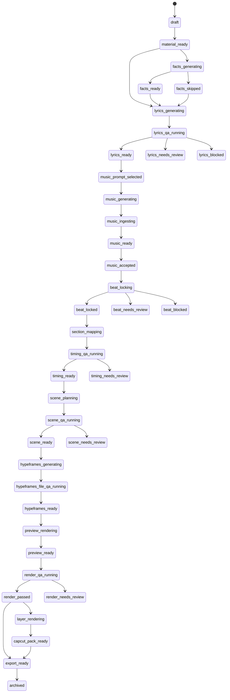

# 工作流状态机定义

> 文档版本：v0.1  
> 文档类型：Workflow State Machine Specification  
> 适用范围：科普 Rap 音乐 + 视频 SaaS 的后端编排、Web UI、Agent API、积分账本  
> 核心原则：状态机唯一真值、StepRun 可审计、QA Gate 显式化、失败可恢复、Preview-First

---

## 1. 文档目标

本文件定义端到端工作流状态机。所有页面展示、Agent 查询、任务调度、积分冻结、失败重试和导出权限都必须基于状态机，而不是由前端局部判断。

状态机覆盖以下阶段：

1. 输入与资料准备；
2. 事实卡与歌词生成；
3. 歌词 QA；
4. MiniMax Music 生成与音乐锁定；
5. Beat Lock 与 Section Mapping；
6. 视频分镜与 Scene QA；
7. HypeFrames 工程生成与文件 QA；
8. Preview 渲染与 Render QA；
9. 分层资产与剪映交接包；
10. 导出、失败、取消、归档。

---

## 2. 核心对象

### 2.1 Project

Project 是用户或 Agent 发起的一次完整创作任务。

| 字段 | 说明 |
|---|---|
| `project_id` | 项目唯一 ID。 |
| `workspace_id` | 所属工作区。 |
| `created_by_type` | `human` / `agent` / `system`。 |
| `workflow_state` | 当前项目状态。 |
| `budget_limit` | 项目预算上限。 |
| `credits_reserved` | 当前冻结积分。 |
| `credits_spent` | 已结算积分。 |
| `active_step_run_id` | 当前运行中的 StepRun。 |
| `locked_music_artifact_id` | 已接受音乐资产。 |
| `preview_artifact_id` | 当前 Preview 成片资产。 |
| `next_action_required` | `none` / `human_review` / `budget_required` / `retry_required`。 |

### 2.2 StepRun

StepRun 是一次可审计任务。所有模型调用、音频分析、QA、渲染、导出都应创建 StepRun。

| 字段 | 说明 |
|---|---|
| `step_run_id` | 任务唯一 ID。 |
| `project_id` | 所属项目。 |
| `step_type` | `lyrics_generation`、`music_generation`、`beat_lock`、`render_preview` 等。 |
| `provider` | DeepSeek、MiniMax、HypeFrames、LocalWorker、LLMReviewer 等。 |
| `status` | StepRun 状态。 |
| `input_artifacts` | 输入资产列表。 |
| `output_artifacts` | 输出资产列表。 |
| `qa_report_ids` | 关联 QA 报告。 |
| `credit_hold_id` | 关联积分冻结。 |
| `credit_settlement_id` | 关联积分结算。 |
| `retry_count` | 已重试次数。 |
| `error_code` | 错误码。 |

### 2.3 Artifact

Artifact 是任意中间产物或最终产物，包括文本、JSON、音频、视频、HypeFrames 工程和压缩包。

### 2.4 QAReport

QAReport 是每个 Gate 的审查结论。

| 状态 | 含义 |
|---|---|
| `auto_approved` | 自动通过。 |
| `approved_with_warnings` | 有警告但不阻断。 |
| `auto_fixed` | 自动修复后通过。 |
| `needs_review` | 需要人工判断。 |
| `blocked` | 阻断后续流程。 |

---

## 3. Project 状态总表

| 状态 | 阶段 | 说明 | 允许的下一步 |
|---|---|---|---|
| `draft` | 输入 | 项目草稿，可编辑输入。 | `material_ready` / `cancelled` |
| `material_ready` | 输入 | 主题、配置、资料已保存。 | `facts_generating` / `lyrics_generating` |
| `facts_generating` | 资料 | DeepSeek 正在生成事实卡。 | `facts_ready` / `facts_skipped` / `failed` |
| `facts_ready` | 资料 | `facts.json` 已生成。 | `lyrics_generating` |
| `facts_skipped` | 资料 | 无资料路径，跳过事实卡。 | `lyrics_generating` |
| `lyrics_generating` | 歌词 | 正在生成歌词和 prompt 候选。 | `lyrics_qa_running` / `failed` |
| `lyrics_qa_running` | 歌词 QA | 正在审查歌词。 | `lyrics_ready` / `lyrics_needs_review` / `lyrics_blocked` |
| `lyrics_ready` | 歌词 | 歌词可进入音乐生成。 | `music_prompt_selected` / `lyrics_generating` |
| `lyrics_needs_review` | 歌词 | 歌词有需人工确认的问题。 | `lyrics_ready` / `lyrics_generating` / `cancelled` |
| `lyrics_blocked` | 歌词 | 歌词存在阻断问题。 | `lyrics_generating` / `cancelled` |
| `music_prompt_selected` | 音乐 | 已选择 MiniMax music prompt。 | `music_generating` |
| `music_generating` | 音乐 | MiniMax Music 生成中。 | `music_ingesting` / `failed` |
| `music_ingesting` | 音乐 | 下载音频、标准化、写入 manifest。 | `music_ready` / `music_needs_review` / `failed` |
| `music_ready` | 音乐 | 音乐生成成功，可试听。 | `music_accepted` / `music_generating` |
| `music_needs_review` | 音乐 | 音频存在时长、下载、响度或结构异常。 | `music_ready` / `music_generating` / `cancelled` |
| `music_accepted` | 音乐锁定 | 用户或 Agent 接受某一版音乐。 | `beat_locking` |
| `beat_locking` | 节拍 | 检测 BPM、beat、bar、downbeat。 | `beat_locked` / `beat_needs_review` / `beat_blocked` |
| `beat_locked` | 节拍 | `beats.locked.json` 已生成。 | `section_mapping` |
| `beat_needs_review` | 节拍 | 节拍置信度低，需要人工或重新分析。 | `beat_locked` / `music_generating` / `cancelled` |
| `beat_blocked` | 节拍 | 节拍无法用于主时间线。 | `music_generating` / `cancelled` |
| `section_mapping` | 时间线 | 歌词结构映射到实际音频时间。 | `timing_qa_running` / `failed` |
| `timing_qa_running` | 时间线 QA | 审查 section、信息密度、hook 对齐。 | `timing_ready` / `timing_needs_review` / `timing_blocked` |
| `timing_ready` | 时间线 | 时间线可用于视频分镜。 | `scene_planning` |
| `timing_needs_review` | 时间线 | 段落或密度需人工确认。 | `timing_ready` / `section_mapping` / `cancelled` |
| `timing_blocked` | 时间线 | 段落错位、越界或严重不一致。 | `section_mapping` / `music_generating` / `cancelled` |
| `scene_planning` | 分镜 | DeepSeek 生成 scene、caption、visual plan。 | `scene_qa_running` / `failed` |
| `scene_qa_running` | 分镜 QA | 审查科普性、一致性、可读性。 | `scene_ready` / `scene_needs_review` / `scene_blocked` |
| `scene_ready` | 分镜 | 分镜可进入 HypeFrames 工程。 | `hypeframes_generating` |
| `scene_needs_review` | 分镜 | 分镜需人工确认或降级模板。 | `scene_ready` / `scene_planning` / `cancelled` |
| `scene_blocked` | 分镜 | 分镜不可用于视频生成。 | `scene_planning` / `cancelled` |
| `hypeframes_generating` | 工程 | 生成 HypeFrames 工程文件。 | `hypeframes_file_qa_running` / `failed` |
| `hypeframes_file_qa_running` | 工程 QA | 审查文件完整性、路径、时间线、输出模式。 | `hypeframes_ready` / `hypeframes_needs_review` / `hypeframes_blocked` |
| `hypeframes_ready` | 工程 | 可渲染 Preview。 | `preview_rendering` |
| `hypeframes_needs_review` | 工程 | 工程文件有非阻断问题。 | `hypeframes_ready` / `hypeframes_generating` |
| `hypeframes_blocked` | 工程 | 文件缺失、路径错误、不可复现。 | `hypeframes_generating` / `cancelled` |
| `preview_rendering` | 渲染 | 正在渲染 `preview_composite.mp4`。 | `preview_ready` / `render_failed` |
| `preview_ready` | 渲染 | Preview 文件已生成。 | `render_qa_running` / `export_ready` |
| `render_qa_running` | 渲染 QA | 审查时长、音频、关键帧、字幕、透明层。 | `render_passed` / `render_needs_review` / `render_blocked` |
| `render_passed` | 渲染 | Preview 通过，可导出或生成分层资产。 | `layer_rendering` / `capcut_pack_ready` / `export_ready` |
| `render_needs_review` | 渲染 | 渲染结果需人工确认。 | `render_passed` / `preview_rendering` / `export_ready` |
| `render_blocked` | 渲染 | Preview 黑屏、缺音频、严重错时长等。 | `preview_rendering` / `hypeframes_generating` / `cancelled` |
| `layer_rendering` | 分层资产 | 正在渲染 overlay、captions、bg_clean。 | `capcut_pack_ready` / `layer_render_failed` |
| `capcut_pack_ready` | 交接 | 剪映交接包生成完成。 | `export_ready` |
| `export_ready` | 导出 | 用户可下载产物。 | `archived` |
| `failed` | 失败 | 未分类失败或系统级失败。 | `retry_previous_step` / `cancelled` |
| `cancelled` | 终止 | 用户或系统取消。 | 无 |
| `archived` | 归档 | 项目已归档，只读。 | 无 |

---

## 4. StepRun 状态

| 状态 | 含义 | 是否可重试 |
|---|---|---:|
| `queued` | 已入队等待执行。 | 是 |
| `holding_credits` | 正在冻结积分。 | 是 |
| `running` | 任务执行中。 | 否 |
| `qa_running` | 任务后 QA 执行中。 | 否 |
| `succeeded` | 成功完成。 | 否 |
| `succeeded_with_warnings` | 成功但有非阻断警告。 | 否 |
| `failed_retryable` | 可重试失败，如 Provider 超时。 | 是 |
| `failed_blocking` | 阻断失败，如输入非法、文件缺失。 | 否，需修复输入 |
| `timed_out` | 执行超时。 | 是 |
| `cancelled` | 被用户或系统取消。 | 否 |

---

## 5. 事件定义

### 5.1 用户/Agent 事件

| 事件 | 触发方 | 说明 |
|---|---|---|
| `PROJECT_CREATE` | Human / Agent | 创建项目。 |
| `MATERIAL_SUBMIT` | Human / Agent | 提交主题和资料。 |
| `LYRICS_GENERATE_REQUEST` | Human / Agent / Auto | 请求生成歌词。 |
| `LYRICS_EDIT_SAVE` | Human | 保存人工编辑歌词版本。 |
| `MUSIC_PROMPT_SELECT` | Human / Agent | 选择音乐 prompt。 |
| `MUSIC_GENERATE_REQUEST` | Human / Agent / Auto | 请求 MiniMax Music 生成。 |
| `MUSIC_ACCEPT` | Human / Agent | 接受某一版音乐。 |
| `VIDEO_GENERATE_REQUEST` | Human / Agent / Auto | 触发视频分镜与工程生成。 |
| `PREVIEW_RENDER_REQUEST` | Human / Agent / Auto | 请求渲染 Preview。 |
| `REVIEW_APPROVE` | Human / Operator | 人工放行。 |
| `REVIEW_REJECT` | Human / Operator | 人工拒绝或要求重做。 |
| `EXPORT_REQUEST` | Human / Agent | 请求导出。 |
| `CANCEL_PROJECT` | Human / Agent / System | 取消项目。 |

### 5.2 系统事件

| 事件 | 说明 |
|---|---|
| `CREDIT_HOLD_SUCCEEDED` | 积分冻结成功。 |
| `CREDIT_HOLD_FAILED` | 积分不足或冻结失败。 |
| `STEP_RUN_SUCCEEDED` | StepRun 成功。 |
| `STEP_RUN_FAILED_RETRYABLE` | 可重试失败。 |
| `STEP_RUN_FAILED_BLOCKING` | 阻断失败。 |
| `QA_AUTO_APPROVED` | QA 自动通过。 |
| `QA_APPROVED_WITH_WARNINGS` | QA 带警告通过。 |
| `QA_NEEDS_REVIEW` | QA 需要人工。 |
| `QA_BLOCKED` | QA 阻断。 |
| `CREDIT_SETTLED` | 积分结算完成。 |
| `CREDIT_RELEASED` | 冻结积分释放。 |
| `ARTIFACT_CREATED` | 新资产生成。 |
| `WEBHOOK_DELIVERED` | Agent Webhook 已通知。 |

---

## 6. QA Gate 与状态转换

| Gate | 运行状态 | 通过状态 | 警告状态 | 人工状态 | 阻断状态 |
|---|---|---|---|---|---|
| Lyrics QA | `lyrics_qa_running` | `lyrics_ready` | `lyrics_ready` | `lyrics_needs_review` | `lyrics_blocked` |
| Music Ingest QA | `music_ingesting` | `music_ready` | `music_ready` | `music_needs_review` | `failed` |
| Beat Lock QA | `beat_locking` | `beat_locked` | `beat_locked` | `beat_needs_review` | `beat_blocked` |
| Timing QA | `timing_qa_running` | `timing_ready` | `timing_ready` | `timing_needs_review` | `timing_blocked` |
| Scene QA | `scene_qa_running` | `scene_ready` | `scene_ready` | `scene_needs_review` | `scene_blocked` |
| HypeFrames File QA | `hypeframes_file_qa_running` | `hypeframes_ready` | `hypeframes_ready` | `hypeframes_needs_review` | `hypeframes_blocked` |
| Render QA | `render_qa_running` | `render_passed` | `render_passed` | `render_needs_review` | `render_blocked` |
| Master QA | `render_qa_running` 或导出前 | `export_ready` | `export_ready` | `render_needs_review` | `render_blocked` |

---

## 7. 自动推进规则

### 7.1 可自动推进条件

项目可自动进入下一步，必须同时满足：

1. 当前 Gate 结果为 `auto_approved`、`approved_with_warnings` 或 `auto_fixed`；
2. 项目未超出 `budget_limit`；
3. Workspace 余额足够下一步预冻结；
4. Agent 或用户设置允许自动推进；
5. 下一步不是需要主观选择的步骤，或已配置默认选择策略；
6. 当前项目没有人工锁定标记。

### 7.2 必须暂停条件

| 条件 | 状态 |
|---|---|
| QA 结果为 `needs_review` | 进入对应 `*_needs_review`。 |
| QA 结果为 `blocked` | 进入对应 `*_blocked`。 |
| 积分不足 | `next_action_required = budget_required`。 |
| Agent 超出预算 | 停止自动推进，进入 `needs_review` 或保持当前状态。 |
| 音乐生成成功但未开启自动接受 | 停在 `music_ready`。 |
| Preview 生成成功但未开启自动接受 | 停在 `preview_ready` 或 `render_passed`。 |

---

## 8. 积分与状态绑定

### 8.1 高成本步骤必须预冻结

| 步骤 | 是否冻结 | 说明 |
|---|---:|---|
| 事实卡生成 | 可选 | 成本低，可按策略决定。 |
| 歌词生成 | 是 | 防刷请求。 |
| MiniMax Music 生成 | 是 | 高成本。 |
| Beat Lock / Section Mapping | 可选 | 可计入视频生成包。 |
| 分镜规划 | 是 | LLM 调用。 |
| HypeFrames 工程生成 | 是 | LLM/Codex/模板生成成本。 |
| Preview 渲染 | 是 | 本地或云端渲染资源。 |
| 分层资产渲染 | 是 | 高资源步骤。 |
| 导出压缩包 | 可选 | 可按存储/下载计费。 |

### 8.2 结算规则

| 场景 | 积分处理 |
|---|---|
| StepRun 成功 | 结算冻结积分或按实际用量结算。 |
| Provider 明确失败 | 释放冻结积分。 |
| 系统渲染失败 | 释放或退还冻结积分。 |
| 用户取消未开始任务 | 释放冻结积分。 |
| 用户取消执行中任务 | 按已执行成本部分结算，剩余释放。 |
| 用户不满意但任务成功 | 不自动退款。 |
| 自动重试 | 可使用原冻结额度，超过上限需重新确认。 |

---

## 9. 重试规则

| 失败类型 | 示例 | 默认处理 |
|---|---|---|
| Provider 超时 | MiniMax API 超时 | 自动重试，最多 N 次。 |
| 网络错误 | 下载临时 URL 失败 | 自动重试下载。 |
| 格式错误可修复 | LLM JSON 缺字段 | 自动修复一次并复审。 |
| 文件缺失 | HypeFrames 资产路径错误 | 阻断，回到工程生成。 |
| 音频节拍低置信度 | BPM 双倍/半速冲突 | 进入人工或重新生成音乐。 |
| 渲染黑屏 | Preview 关键帧为空 | 重新渲染或回到 HypeFrames 生成。 |
| 预算不足 | 项目预算耗尽 | 暂停，等待预算调整。 |

---

## 10. Agent 专用状态字段

Agent API 查询项目时，除 `workflow_state` 外，还应返回：

| 字段 | 说明 |
|---|---|
| `run_id` | Agent Run ID。 |
| `current_step` | 当前步骤。 |
| `next_action_required` | 下一步是否需要 Agent 或人类动作。 |
| `allowed_actions` | 当前状态下可调用的动作。 |
| `budget_remaining` | Agent 本项目剩余预算。 |
| `can_auto_continue` | 是否可继续自动推进。 |
| `blocking_reason` | 阻断原因。 |
| `artifact_summary` | 已生成资产摘要。 |
| `qa_summary` | 最新 QA 总结。 |

---

## 11. 状态机 Mermaid 草图

---

## 12. MVP 验收标准

| 编号 | 验收项 | 通过标准 |
|---|---|---|
| WF-01 | 状态唯一真值 | Web UI 和 Agent API 显示同一 `workflow_state`。 |
| WF-02 | StepRun 可审计 | 每个生成、QA、渲染任务均有 StepRun。 |
| WF-03 | QA 可阻断 | 任一 Gate 为 `blocked` 时不能自动进入下一步。 |
| WF-04 | 音乐锁定 | 接受音乐后生成 `locked_music_artifact_id`，后续时间线以该音频为准。 |
| WF-05 | Preview 优先 | `preview_composite.mp4` 是第一视频交付状态。 |
| WF-06 | 失败可恢复 | 可重试失败能回到上一稳定状态。 |
| WF-07 | 积分绑定 | 高成本 StepRun 先冻结后结算。 |
| WF-08 | Agent 可控 | Agent 超预算或需人工时自动暂停。 |
| WF-09 | 导出门槛 | 导出状态依赖 Render QA 或人工接受。 |
| WF-10 | 归档只读 | `archived` 项目不允许继续变更资产。 |
