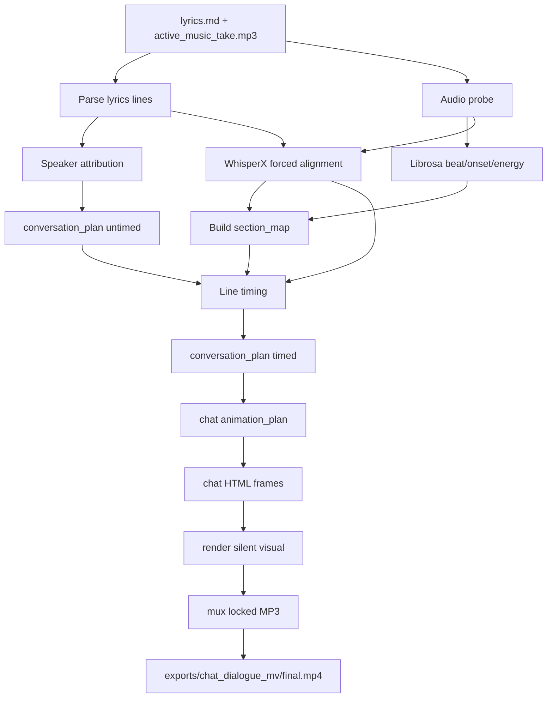

# Qivance Music 子 PRD：问答歌词聊天对话 MV 链路

> 日期：2026-06-14
> 状态：Draft
> 父级上下文：`docs/qivance_music_html_video_integration_prd.md`、`docs/qivance_music_html_video_integration_prd.v3.md`
> 目标：新增一条独立的 `chat_dialogue_mv_chain`，面向“歌词本身已经是问答形式”的 rap 音乐，自动把歌词原文按句映射为抖音双人聊天气泡视频，并复用 Qivance 既有音频分析、timing、html-video render 与最终音频 mux 能力。

---

## 1. 产品定位

`chat_dialogue_mv_chain` 是 Qivance Music 的一条新视频生产链路，不替代现有图片分镜 MV、source video 或通用 html-video 工作台链路。

该链路面向一种明确输入形态：

```text
用户提交歌词 + 已创作完成的 rap 歌曲 MP3
歌词本身已经是问答式脚本
```

链路输出为：

```text
抖音双人聊天背景
歌词逐句弹出为聊天气泡
最终 mux 原始 MP3 的 final.mp4
```

核心原则：

- 歌词是唯一文案源。
- 聊天气泡文本直接照搬歌词。
- 系统只判断每行歌词属于提问者或回答者，不做转译、改写、扩写或补充解释。
- 时间图谱由 `lyric_word_timing.json`、`section_map.json`、`beat_grid.json` 驱动。
- HTML 只负责呈现，不负责推断时间或改写文本。

---

## 2. 已确认决策

| 编号 | 决策项 | 结论 |
|---|---|---|
| D1 | 链路形态 | 新增独立链路 `chat_dialogue_mv_chain`，不混入现有图片分镜链路 |
| D2 | 文案策略 | 歌词本身是问答形式，聊天气泡直接使用歌词原文 |
| D3 | 禁止行为 | 不逐句转译、不重写、不生成新对话、不补充教学解释 |
| D4 | 角色识别 | 只做 speaker 归属识别：提问者 / 回答者 |
| D5 | 显式标注优先级 | 如果歌词中已有双人标签 `A:` / `B:`，或问答标签 `问:` / `答:` / `Q:` / `Answer:`，优先使用标注 |
| D6 | 无标注 fallback | 无法判断时按上下文交替，但仍保留歌词原文 |
| D7 | 展示文本 | 可隐藏角色前缀，但必须保存原始歌词行和展示文本的对应关系 |
| D8 | 并行模型 | 同链路内部按 DAG 并行，跨链路共享 timing bundle 后并行渲染 |
| D9 | 最终音频 | final.mp4 必须 mux 用户提交的原始 rap MP3 或锁定 master audio |
| D10 | 首版比例 | 默认 9:16 竖屏，后续继承 16:9 / 1:1 能力 |

---

## 3. MVP 范围

MVP 包含：

```text
lyrics.md + active_music_take.mp3
→ parse lyrics lines
→ speaker attribution
→ audio analysis
→ lyric/line timing
→ section_map
→ conversation_plan
→ chat HTML frames
→ visual render
→ mux original audio
→ final.mp4
```

MVP 不包含：

- LLM 改写歌词。
- 逐句语义转译。
- 自动新增问答内容。
- 手动时间线编辑器。
- 多聊天模板市场。
- 复杂头像生成。
- 生图链路。
- 直接修改 `lyrics.md`。

---

## 4. 输入与输出

### 4.1 输入

必需输入：

```text
lyrics.md
audio/master/active_music_take.mp3
```

可选输入：

```text
project_manifest.json
qivance/animation_plan.json
data/timing/beat_grid.json
data/timing/lyric_word_timing.json
data/timing/section_map.json
```

如果 timing 产物已存在且 hash 与输入一致，可以复用；否则必须重新生成。

### 4.2 输出

链路产物写入独立目录：

```text
data/chains/chat_dialogue_mv/
  conversation_plan.json
  animation_plan.json
  frame_contracts.json
  qa_report.json

video/html-video/.html-video/projects/<project_id>/frames/
exports/chat_dialogue_mv/
  visual.mp4
  final.mp4
  render_manifest.json
```

共享 timing 产物继续放在：

```text
data/timing/beat_grid.json
data/timing/onset_events.json
data/timing/energy_curve.json
data/timing/lyric_word_timing.json
data/timing/section_map.json
```

---

## 5. 链路 DAG



---

## 6. 并行策略

### 6.1 同链路内部并行

同一个 `chat_dialogue_mv_chain` 内部可以并行：

- `parse lyrics lines` 与 `audio probe`。
- `speaker attribution` 与 `Librosa audio analysis`。
- `speaker attribution` 与 `WhisperX forced alignment`。
- 多个 frame HTML 的生成与静态 QA。
- 多个 frame 的 screenshot / layout smoke 检查。

必须串行或等待汇合：

- `conversation_plan.timed` 必须等待 speaker attribution、line timing 和 section map。
- visual render 必须等待所有 frames 通过合同校验。
- final mux 必须等待 visual render。
- final QA 必须等待 mux 完成。

### 6.2 不同链路之间并行

同一个项目可以并行运行多条视频链路：

```text
shared timing bundle
├─ chat_dialogue_mv_chain
├─ image_storyboard_mv_chain
├─ kinetic_subtitle_chain
└─ source_video_chain
```

共享产物：

```text
lyrics.md
active_music_take.mp3
data/timing/*.json
```

链路私有产物：

```text
data/chains/<chain_id>/**
exports/<chain_id>/**
```

跨链路并行规则：

- timing bundle 只生成一次，后续链路复用。
- 不同链路不得写同一个 `exports/final.mp4`。
- 每条链路有独立 `render_manifest.json`。
- 多条链路可同时 render，但需要全局并发限制，避免 WhisperX、Chromium render、ffmpeg 抢占资源。

---

## 7. 歌词解析与 speaker 归属

### 7.1 文本保真原则

`lyrics.md` 是气泡文案的唯一来源。系统不得自动修改歌词字词。

允许的处理：

- 去除 Markdown 标题行。
- 跳过空行。
- 识别但不强制展示角色前缀。
- 将原始行与展示行同时保存。

禁止的处理：

- 改写歌词。
- 把歌词翻译成教学表达。
- 新增解释句。
- 合并多行导致原行不可追溯。
- 删除歌词中的实质内容。

### 7.2 角色识别优先级

1. 显式标注优先：

```text
A:
B:
Q:
Answer:
问：
答：
提问：
回答：
甲：
乙：
```

2. 疑问标点或疑问词：

```text
？ ? 为什么 怎么 是否 能不能 是不是 哪个 谁 什么
```

3. 上下文交替：

如果无显式标注且无法判断，按上一条消息的 speaker 交替。

4. 保守 fallback：

如果整段无法判断，默认第一句为提问者，下一句为回答者，之后交替。

### 7.3 前缀显示策略

保存原始行：

```json
{
  "raw_text": "问：为什么模型总是乱回答？",
  "display_text": "为什么模型总是乱回答？"
}
```

气泡默认展示 `display_text`，但 QA 和 manifest 必须能追溯到 `raw_text`。

---

## 8. `conversation_plan.json`

`conversation_plan.json` 是该链路的核心合同。

```json
{
  "schema_version": 1,
  "chain_id": "chat_dialogue_mv",
  "text_policy": "verbatim_lyrics",
  "source": {
    "lyrics_path": "lyrics.md",
    "audio_path": "audio/master/active_music_take.mp3",
    "lyrics_sha256": "...",
    "audio_sha256": "..."
  },
  "speakers": [
    {
      "id": "questioner",
      "label": "提问者",
      "side": "left"
    },
    {
      "id": "answerer",
      "label": "回答者",
      "side": "right"
    }
  ],
  "messages": [
    {
      "id": "msg_001",
      "source_line_id": "line_001",
      "speaker": "questioner",
      "side": "left",
      "raw_text": "问：为什么模型总是乱回答？",
      "display_text": "为什么模型总是乱回答？",
      "text_policy": "verbatim_lyrics",
      "attribution_source": "explicit_prefix",
      "start_sec": 0.82,
      "end_sec": 2.4,
      "section_id": "sec_001",
      "confidence": 1.0
    }
  ]
}
```

校验要求：

- `text_policy` 必须是 `verbatim_lyrics`。
- 每条 message 必须有 `source_line_id`。
- `raw_text` 必须来自 `lyrics.md`。
- `display_text` 只能移除角色前缀或两侧空白，不得改写实质文本。
- `start_sec < end_sec`。
- message 时间范围必须落在音频时长内。
- messages 必须按时间排序。

---

## 9. Timing 规则

### 9.1 行级 timing

首选：

```text
lyric_word_timing.json words
→ line_id 聚合
→ 每行 start_sec / end_sec
```

fallback：

```text
lyrics line count
→ section duration 或 total duration 均分
→ beat_grid 吸附
```

fallback 必须写入 QA：

```json
{
  "timing_source": "fallback_line_even_split",
  "reason": "whisperx_alignment_missing"
}
```

### 9.2 气泡弹出点

- 气泡进入时间以 line start 为准。
- 可向最近 beat/onset 吸附，但漂移不超过 0.25s。
- 不得因为动画效果改变 message 的实际语义时间。
- 超短行最短显示 0.6s。
- 相邻气泡可重叠显示，但新气泡进入不得早于其 line start。

### 9.3 section map

`section_map.json` 仍由歌词结构、word timing、beat/onset/energy 证据生成。

该链路只消费 section map 来决定：

- frame / scene 边界。
- 聊天背景节奏变化。
- 气泡列表窗口滚动策略。
- render duration。

---

## 10. HTML 聊天模板

MVP 使用一个固定静态 HTML 模板：

```text
9:16 竖屏
手机聊天界面
左右双人气泡
顶部仿短视频状态栏
底部输入栏或轻量装饰
消息按时间弹出
列表自动滚动
beat/onset 驱动轻微弹跳、闪烁或震动
```

模板要求：

- 不依赖远程资源。
- 所有时间由内嵌 JSON 或 frame contract 驱动。
- 文本必须在气泡内完整显示。
- 长句允许换行，不允许溢出。
- 不允许 HTML 运行时改写 message 文本。
- 每个 frame 必须遵守 strict duration。

---

## 11. Render 与导出

render 流程：

```text
chat HTML frames
→ html-video visual render
→ silent visual.mp4
→ mux active_music_take.mp3
→ exports/chat_dialogue_mv/final.mp4
```

导出要求：

- `final.mp4` 有且只有一个音频流。
- 音频来源为用户提交的 MP3 或锁定 master audio。
- final duration 与音频 duration 漂移不超过 150ms。
- `render_manifest.json` 记录 chain_id、输入 hash、timing 产物、conversation plan、HTML frames、visual render、mux QA。

---

## 12. Workbench 状态

该链路在工作台中应表现为独立链路状态，而不是覆盖通用 project 状态。

建议状态：

```text
not_started
input_ready
timing_running
timing_ready
conversation_plan_ready
frames_ready
preview_ready
rendering
export_ready
failed
```

失败应包含：

```json
{
  "chain_id": "chat_dialogue_mv",
  "stage": "conversation_plan_failed",
  "error_message": "...",
  "input_artifacts": ["lyrics.md", "data/timing/lyric_word_timing.json"],
  "retryable": true
}
```

---

## 13. 验收标准

MVP 完成时必须满足：

- 用户提交歌词和 MP3 后，可以自动生成 `conversation_plan.json`。
- `conversation_plan.json` 中的气泡文本直接来自歌词，不发生改写。
- 系统能识别显式问答前缀并分配左右角色。
- 无显式前缀时有 deterministic fallback。
- 气泡按歌词行 timing 弹出。
- 生成 9:16 聊天 HTML 画面。
- 输出 `exports/chat_dialogue_mv/final.mp4`。
- final MP4 保留原始 rap 音频。
- render manifest 能追溯歌词、音频、timing、conversation plan 和导出文件。
- 该链路产物不覆盖其他链路产物。

---

## 14. 后续扩展

后续可扩展但不进入 MVP：

- 多聊天皮肤。
- 多人群聊模式。
- 手动修正 speaker attribution。
- 手动拖拽气泡 timing。
- 自动头像或角色设定生成。
- 评论区 / 弹幕混合模板。
- 同一 timing bundle 下批量生成多种风格视频。
- 链路优先级和资源调度 UI。
