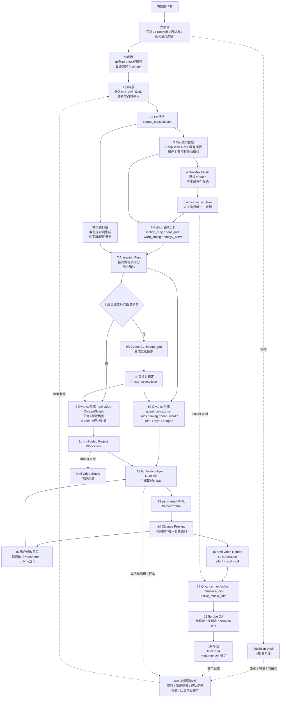

# Qivance Music × html-video 后端接入需求文档 v0.3

> 更新日期：2026-06-15
> 目标：将 Qivance Music 的视频生成结构迁移到 [`nexu-io/html-video`](https://github.com/nexu-io/html-video) 体系。旧的 Qivance 自建 `Codex runner + HyperFrames workspace` 直连链路废弃；新链路以 html-video 的 Project / ContentGraph / Frame HTML / Agent runtime / Render pipeline 为视频生成内核，由 Qivance 继续负责任务编排、资料/RAG、歌词、音乐、音频分析、可选图像素材生成、最终音频锁定和成品交付。

---

## 0. 已确认的关键决策

| 编号 | 决策项 | 已确认方案 |
|---|---|---|
| 1 | html-video 接入形态 | **B 方案**：作为 `vendor/submodule/fork` 深度接入，后端直接 import 或封装 html-video core/adapter/studio 能力 |
| 2 | 旧 HyperFrames 链路 | **废弃旧链路**：不再使用 Qivance 自建 `Codex runner + hypeframes/**` 工程链路；接受新的 html-video 视频生成结构 |
| 3 | ContentGraph 拆分粒度 | 按**视觉场景**拆，由 `Animation Plan` 决定 frame / scene 边界 |
| 4 | word-level timing 用途 | 用于**字幕逐词高亮** + **关键词 pop 动画**，不强行驱动所有视觉元素 |
| 5 | 模板策略 | 当前版本先复用 **html-video 内置模板 / 最小固定模板**；Qivance rap 教学模板包进入后续产品化 |
| 6 | Preview | 生产流程只展示 **Qivance Preview**；`html-video studio` 仅作为内部 debug 工具 |
| 7 | Agent runtime | 使用 **html-video 自带 agent runtime**；删除 Qivance 自己的 Codex runner |
| 8 | 最终音频 mux | **Qivance 自己 mux active_music_take**；html-video 输出 silent visual 或不可信音频版本不作为最终交付 |
| 9 | frame duration | **禁止自动延长**，严格按 `section_map` / `Animation Plan` / `ContentGraph.durationSec` 渲染 |
| 10 | 输出比例 | 同时支持 **9:16 / 16:9 / 1:1** |
| 11 | 可选生图 | 在 `Animation Plan` 确认后、进入 html-video 前，允许通过 **Codex CLI 会话中的 image_gen 能力**生成候选图像素材；默认跳过，生成后必须审核并锁定为本地 image asset，html-video 只消费锁定素材 |
| 12 | 产品形态 | **内部使用工作台**：取消 SaaS 功能；登录、用户体系、复杂权限、Cloudflare Access / Tailscale 等访问控制能力延后 |
| 13 | 模板与资源产品化 | P0/P1 先复用内置模板和最小文件证据；Qivance 模板包、模板市场、素材库产品化、`resources.zip` 延后 |
| 14 | V5 产品入口 | 两步创建项目：先创建空项目，再上传歌词和音频；用户确认输入后自动执行 |
| 15 | V5 数据库 | 使用 SQLite + Prisma 作为内部控制面；媒体文件、JSON artifacts 和 MP4 仍保存在项目目录 |
| 16 | V5 调度执行 | 使用 Node server 内置 runner loop；支持 graceful stop 和重启恢复 |
| 17 | V5 Chain 方向 | Chain registry 保留扩展点；V5 P0 只启用 `chat_dialogue_mv`；删除 `image_storyboard_mv` 后续产品路线，下一版本再做 `video_chain` |

### 0.1 V1 校准结论

本 PRD 以 `TEST_REPORT.v1` 和需求追踪矩阵为校准基准。V1 已完成 html-video vendor/submodule 接入、ContentGraph 映射、workspace 写入、Codex frame prompt、严格 duration wrapper、Preview API 骨架、render manifest 与 mux wrapper 的结构性落地。

仍未证明或未实现的部分保持为后续需求：真实 Codex frame authoring E2E、真实 html-video render E2E、真实 ffmpeg mux + ffprobe QA、timing bundle 深度解析、用户修改迭代、生产 Preview UI、大项目/资料/RAG/歌词/音乐上游流程、Qivance rap 模板包、`resources.zip`。PRD 中的目标态要求不代表 V1 已全部完成；实施路线按阶段推进。

### 0.2 V5 校准结论

V5 以 `docs/qivance_music_html_video_integration_prd.v5.md` 为版本源文档。V5 不补全早期总 PRD 中所有目标态能力，而是聚焦：

```text
- 内部操作者产品入口：创建项目、上传歌词、上传音频、确认输入
- SQLite + Prisma 控制面：project/input/artifact/chain/run/task/event
- Server 内置 runner loop：确认输入后自动跑 timing pipeline 和 chat_dialogue_mv
- 最小内部 Workbench：创建、上传、确认、查看 run/task/event、graceful stop、下载 final MP4
```

V5 明确不做：

```text
- SaaS、登录、用户体系、复杂权限、Cloudflare Access、Tailscale
- 模板市场、Qivance rap 模板包产品化、resources.zip
- DeepSeek 歌词生成、MiniMax 音乐生成、多 take 选择
- image_storyboard_mv 后续链路
- video_chain（下一版本再做）
```

### 0.3 V7 聊天页视觉与后台可编辑资料目标

V7 的 `chat_dialogue_mv` 视觉目标是模拟抖音私信页，不新增链路、不改变 timing / scheduler / export 合同。完整目标态包括：

```text
- 聊天帧默认显示联系人名字和头像
- 只有左侧新气泡出现的帧，顶部标题才临时显示“对方正在输入....”
- 其它帧顶部恢复联系人名字
- 联系人名字、联系人头像、左右消息头像应可从后台/admin 编辑
- 后台编辑后的资料进入 chat frame renderer，不需要改源码
- 头像使用本地锁定 PNG 资源，不使用远程 URL
- 聊天文本仍来自歌词原文，不改写、不转译、不生成图片消息卡片
```

V7 最小版本先在 renderer 层支持可选 `chat_ui` 配置字段：

```json
{
  "chat_ui": {
    "contact_name": "蒲涛",
    "contact_status": "今天在线",
    "contact_avatar_src": "../assets/avatars/contact.png",
    "left_avatar_src": "../assets/avatars/left.png",
    "right_avatar_src": "../assets/avatars/right.png"
  }
}
```

后续完整后台版本再补：

```text
- 后台/admin 表单编辑联系人名和头像
- 头像文件上传、锁定、路径校验、替换与回滚
- 配置写入项目级 artifact 或控制面记录
- frame 构建时把配置合并进 conversation_plan 或 renderer context
- Workbench 展示当前联系人资料和头像资源状态
```

完整后台版本必须继续遵守：

```text
- 不新增远程资源依赖
- 不把媒体 blob 存入 SQLite
- 不改变 chat_dialogue_mv 的 chain id、artifact 路径、export 路径、manifest v4 合同
- 不让 UI 配置影响歌词原文、timing 或 final audio mux
```

---

## 1. 产品定位

Qivance Music 是一个内部使用的 rap 教学短视频生产工作台。它负责生产 90-120 秒的短平快教学类 rap 视频，当前覆盖三类内容：

1. **AI 概念类**
   - 例如：RAG、Agent、Embedding、Function Calling、MCP、工作流自动化。
   - 目标：通过 rap + 强视觉钩子快速建立概念印象。

2. **英语单词类**
   - 高中 / 四六级 / 雅思三档。
   - 面向高频词、易混词、搭配、考试常见表达。
   - 目标：用短视频节奏制造记忆点，不做完整课程讲授。

3. **特定场景 AI 工具使用类**
   - 例如：用 AI 做简历优化、Excel 分析、论文资料整理、短视频脚本、会议纪要等。
   - 目标：快速展示场景、步骤、结果和吸引点。

成品目标：

```text
90-120s rap + 教学类短视频
重点：短平快 / 抓注意力 / 教个大概 / 可批量更新
最终交付：final.mp4
附带资源：`resources.zip` 延后，不进入当前产品交付范围
```

---

## 2. 新总架构

### 2.1 架构原则

Qivance 继续作为业务编排层；html-video 作为视频生成内核层。

```text
Qivance 负责：
- 大项目 / 小项目
- 内部项目操作边界（暂不做登录、用户体系和复杂权限）
- Obsidian MD 资料层
- RAG 资源回收与复用
- DeepSeek API 歌词生成
- MiniMax Music API rap 音乐生成
- active_music_take 选择
- Python 音频分析
- section_map / beat_grid / word-level timing
- Animation Plan 生成与确认
- 可选图像生成请求、审核、锁定与回收
- 最终 master audio mux
- final.mp4 导出与回收
- 后续访问控制评估（Cloudflare Access / Tailscale 等，不进入当前版本）

html-video 负责：
- 视频项目结构
- ContentGraph 多场景 storyboard
- 内置模板消费
- 模板 registry / 模板市场作为后续产品化能力
- 自带 agent runtime
- 每帧 HTML 生成与维护
- 本地 preview HTML
- 本地 MP4 visual render
- Studio debug 能力
- 消费 Qivance 已锁定的本地图像素材
```

### 2.2 新主链路图



---

## 3. 和 html-video 的关系

### 3.1 使用方式

采用 vendor/submodule/fork 深度接入。

建议目录：

```text
qivance-music/
├─ apps/
│  └─ web/
├─ packages/
│  ├─ qivance-core/
│  ├─ qivance-rag/
│  ├─ qivance-audio/
│  ├─ qivance-image-generation/
│  └─ qivance-video-html/
├─ vendor/
│  └─ html-video/                 # git submodule 或 fork
├─ templates/
│  └─ qivance-rap/                # 后续产品化：Qivance 专属模板
└─ projects/
```

推荐不要以 CLI 黑盒方式长期集成，因为 Qivance 需要控制：

```text
- active_music_take 锁定
- section_map / beat_grid / word_timing
- Animation Plan 到 ContentGraph 的确定性映射
- 可选 image generation 的请求、审核、锁定和 provenance
- strict frame duration
- render_manifest
- RAG 回收钩子
- 生产 Preview 与 debug Studio 的分离
```

### 3.2 旧链路废弃范围

废弃：

```text
- Qivance 自建 Codex runner
- 旧 hypeframes/** 作为主视频工程目录
- 旧 Codex 写入范围控制：hypeframes/** / qa/hypeframes/** / logs/codex/**
- 旧 HyperFrames 插件直连流程
- 旧“Codex 作为独立 HyperFrames composition engineer”的主链路
```

保留思想但迁移实现：

```text
- 音乐驱动视频生成
- agent_context 权威上下文
- Animation Plan 先确认后制作
- Preview 后迭代
- 最终 locked master audio
- render_manifest / logs / assets 回收
```

注意：html-video 当前默认可运行引擎仍可能使用其内部的 `adapter-hyperframes` 命名与实现。这里的“废弃 HyperFrames”指废弃 **Qivance 旧的 HyperFrames 直连工程链路**，不是禁止 html-video 内部使用它自己的默认渲染 adapter。

---

## 4. 项目模型

### 4.1 两级项目

```text
User Account
└─ Big Project
   ├─ Obsidian Vault Binding
   ├─ Prompt Preset Set
   ├─ Music Style Library
   ├─ Template Library Scope
   ├─ RAG Namespace
   └─ Small Project[]
      ├─ Sources
      ├─ Lyrics Candidates
      ├─ Music Takes
      ├─ Timing Artifacts
      ├─ Animation Plan
      ├─ html-video Project Workspace
      ├─ Preview / Render
      └─ Exported MP4
```

### 4.2 大项目字段

```json
{
  "big_project_id": "bp_ai_vocab_001",
  "owner_account_id": "acct_001",
  "name": "AI概念Rap系列",
  "category_scope": ["ai_concept", "english_vocab", "ai_tool_scenario"],
  "obsidian_vault_path": "/vaults/ai-rap",
  "prompt_preset_set_id": "prompt_set_default_001",
  "music_style_library_id": "music_style_rap_001",
  "template_scope": ["html-video-builtin", "qivance-rap"],
  "rag_namespace": "rag_bp_ai_vocab_001",
  "created_at": "2026-06-06T00:00:00.000Z",
  "updated_at": "2026-06-06T00:00:00.000Z"
}
```

### 4.3 小项目字段

```json
{
  "small_project_id": "sp_000001",
  "big_project_id": "bp_ai_vocab_001",
  "title": "RAG到底是什么",
  "content_category": "ai_concept",
  "target_duration_sec": 105,
  "aspect_ratio": "9:16",
  "resolution": { "width": 1080, "height": 1920 },
  "fps": 30,
  "emotion": "炸裂 / 冷酷 / 热血 / 轻松 / 讽刺 / 赛博感",
  "exam_level": null,
  "image_generation_policy": "off | optional",
  "image_asset_manifest": null,
  "active_lyrics_version": "lyrics_v001",
  "active_music_take": "take_001",
  "html_video_project_id": "hv_proj_xxxxxxxx",
  "status": "animation_plan_pending",
  "export_path": null,
  "created_by": "user_001",
  "created_at": "2026-06-06T00:00:00.000Z",
  "updated_at": "2026-06-06T00:00:00.000Z"
}
```

---

## 5. 文件目录结构

推荐小项目目录结构：

```text
projects/
└─ <account_id>/
   └─ <big_project_id>/
      ├─ big_project.json
      ├─ obsidian_vault/                    # 可为绑定路径或软链接
      ├─ rag_index/
      └─ shorts/
         └─ <small_project_id>/
            ├─ qivance_project.json
            ├─ sources/
            │  ├─ raw/
            │  │  └─ source_001.md
            │  └─ source_capsule.json
            ├─ lyrics/
            │  ├─ candidates/
            │  │  └─ lyrics_v001.md
            │  └─ active_lyrics.json
            ├─ teaching/
            │  └─ teaching_pack.md
            ├─ music/
            │  ├─ candidates/
            │  │  └─ take_001/
            │  │     ├─ audio.wav
            │  │     ├─ minimax_request.json
            │  │     └─ minimax_response.json
            │  └─ active_take.json
            ├─ audio/
            │  └─ master/
            │     └─ minimax_rap_master.wav
            ├─ assets/
            │  └─ images/
            │     ├─ generated/             # 可选：Codex CLI image_gen 产物
            │     └─ references/            # 可选：用户上传或历史复用参考图
            ├─ data/
            │  ├─ timing/
            │  │  ├─ section_map.json
            │  │  ├─ beat_grid.json
            │  │  ├─ lyric_word_timing.json
            │  │  └─ energy_curve.json
            │  └─ storyboard/
            │     ├─ animation_plan.json
            │     ├─ image_generation_plan.json
            │     ├─ image_assets.json
            │     ├─ caption_plan.json
            │     ├─ visual_plan.json
            │     ├─ html_video_content_graph.json
            │     └─ agent_context.json
            ├─ video/
            │  └─ html-video/
            │     ├─ .html-video/
            │     │  └─ projects/
            │     │     └─ <html_video_project_id>/
            │     │        ├─ project.json
            │     │        ├─ content-graph.json
            │     │        ├─ preview.html
            │     │        └─ frames/
            │     │           ├─ 001_hook.html
            │     │           ├─ 002_scene.html
            │     │           └─ 003_outro.html
            │     ├─ templates/
            │     └─ render_workdir/
            ├─ logs/
            │  ├─ tasks/
            │  ├─ agent/
            │  └─ render/
            └─ exports/
               ├─ visual_silent.mp4
               ├─ final.mp4
               ├─ render_manifest.json
               └─ resources.zip           # 后续产品化
```

---

## 6. 状态机

```text
created
→ sources_ready
→ source_capsule_ready
→ lyrics_ready
→ music_candidates_ready
→ active_music_selected
→ timing_ready
→ animation_plan_pending
→ animation_plan_approved
→ image_assets_ready（可选；无生图需求时自动跳过）
→ html_video_project_ready
→ frames_ready
→ preview_ready
→ visual_rendered
→ audio_muxed
→ export_ready
→ submitted
```

失败状态：

```text
source_failed
lyrics_failed
music_failed
timing_failed
animation_plan_failed
image_generation_failed
html_video_project_failed
agent_failed
preview_failed
render_failed
mux_failed
qa_failed
export_failed
```

失败记录：

```json
{
  "task_id": "task_20260606_000001",
  "small_project_id": "sp_000001",
  "stage": "render_failed",
  "error_message": "...",
  "input_artifacts": [
    "data/storyboard/html_video_content_graph.json",
    "video/html-video/.html-video/projects/hv_proj_xxx/frames/001_hook.html"
  ],
  "log_path": "logs/tasks/task_20260606_000001.json",
  "retryable": true,
  "created_at": "2026-06-06T00:00:00.000Z"
}
```

---

## 7. 资料层与 RAG

### 7.1 输入

第一版只支持 Markdown：

```text
- 从 Obsidian Vault 选择 MD
- 上传 / 粘贴 MD
- AI 根据选题生成初始 MD
```

### 7.2 清洗

资料进入歌词前，先由内置系统提示词清洗为 `source_capsule.json`。

```json
{
  "source_id": "source_001",
  "content_category": "ai_concept | english_vocab | ai_tool_scenario",
  "topic": "RAG",
  "summary_short": "一句话摘要",
  "summary_for_lyrics": "给rap歌词生成用的表达梗概",
  "core_points": ["..."],
  "keywords": ["..."],
  "exam_level": "high_school | cet4_6 | ielts | null",
  "confusing_words": [],
  "tool_steps": [],
  "visual_hooks": ["..."],
  "avoid": ["..."],
  "source_refs": [
    {
      "file": "source_001.md",
      "heading": "## 什么是RAG",
      "chunk_id": "chunk_001"
    }
  ]
}
```

### 7.3 RAG 回收对象

RAG 不是只做问答，而是生产资产复用系统。

回收：

```text
- 原始 MD chunk
- source_capsule
- 成功歌词表达
- 音乐风格选择记录
- Animation Plan
- 生成图像素材、prompt 与 provenance
- ContentGraph
- 成功 frame HTML 模式
- 用户修改意见
- render_manifest
- final.mp4 元数据
```

检索触发：

```text
- 创建小项目
- 资料清洗
- 歌词生成
- Animation Plan 生成
- ContentGraph 生成
- agent 生成 frame HTML
- 导出后资产回收
```

---

## 8. 歌词与音乐

### 8.1 歌词生成

- DeepSeek API。
- Rap 为主。
- 使用既有提示词模板。
- 用户主要控制：歌曲情绪。
- 其他内容由资料、类目、预设提示词得出。
- 不做单独歌词校验步骤。

歌词候选：

```text
lyrics/candidates/lyrics_v001.md
lyrics/candidates/lyrics_v002.md
lyrics/active_lyrics.json
```

### 8.2 音乐生成

- MiniMax Music API。
- 默认一次生成 1 个 take。
- 用户可以多次生成，保留所有候选。
- 用户人工选择唯一 `active_music_take`。
- 后续只有 `active_music_take` 进入音频分析和最终 mux。

`active_take.json`：

```json
{
  "active_take_id": "take_001",
  "audio_path": "music/candidates/take_001/audio.wav",
  "master_audio_path": "audio/master/minimax_rap_master.wav",
  "duration_sec": 106.48,
  "bpm_hint": 96,
  "structure_hint": "fixed",
  "selected_by": "user_001",
  "selected_at": "2026-06-06T00:00:00.000Z"
}
```

---

## 9. 音频分析与 timing

### 9.1 输出目标

Python 音频分析需要自动输出：

```text
section_map.json
beat_grid.json
lyric_word_timing.json
energy_curve.json
```

### 9.2 word-level timing 使用边界

word-level timing 只用于：

```text
- 字幕逐词高亮
- 关键词 pop / punch 动画
```

不要求第一版把所有视觉元素都绑定到 word-level timing。主视觉节奏由 `Animation Plan`、`section_map`、`beat_grid` 控制。

### 9.3 `section_map.json`

```json
{
  "schema_version": 1,
  "audio_take_id": "take_001",
  "duration_sec": 106.48,
  "sections": [
    {
      "id": "sec_hook_001",
      "type": "hook",
      "start_sec": 0.0,
      "end_sec": 8.0,
      "energy": "high",
      "lyric_lines": ["line_001", "line_002"]
    },
    {
      "id": "sec_verse_001",
      "type": "verse",
      "start_sec": 8.0,
      "end_sec": 40.0,
      "energy": "medium_high",
      "lyric_lines": ["line_003", "line_004"]
    }
  ]
}
```

### 9.4 `lyric_word_timing.json`

```json
{
  "schema_version": 1,
  "audio_take_id": "take_001",
  "lines": [
    {
      "line_id": "line_001",
      "text": "RAG pulls facts before the model starts to rap",
      "start_sec": 0.42,
      "end_sec": 3.20,
      "words": [
        { "word": "RAG", "start_sec": 0.42, "end_sec": 0.70, "is_keyword": true },
        { "word": "pulls", "start_sec": 0.72, "end_sec": 0.98, "is_keyword": false }
      ]
    }
  ]
}
```

---

## 10. Animation Plan

### 10.1 定位

`Animation Plan` 是用户确认的正式视频制作计划。确认后才进入 html-video agent 生成 frame HTML。

它决定：

```text
- 视觉场景拆分
- 每个场景的起止时间
- 每个场景的核心字幕
- 关键词 pop 点
- 模板倾向
- 视觉风格
- 转场方式
- 与 section / beat / word 的关系
```

### 10.2 用户确认

用户可见内容：

```text
- 场景列表
- 每个场景时长
- 每个场景标题 / 字幕摘要
- 关键词动画点
- 模板建议
- 是否需要为某些场景补充图像素材
- 画面情绪
- 输出比例
```

用户操作：

```text
- 确认 Animation Plan
- 要求重新生成
- 修改某个场景
- 调整情绪 / 节奏 / 模板风格
- 为某个场景开启 / 关闭可选生图
```

### 10.3 `animation_plan.json`

```json
{
  "schema_version": 1,
  "small_project_id": "sp_000001",
  "aspect_ratio": "9:16",
  "resolution": { "width": 1080, "height": 1920 },
  "fps": 30,
  "duration_sec": 106.48,
  "scenes": [
    {
      "scene_id": "scene_001_hook",
      "section_ids": ["sec_hook_001"],
      "start_sec": 0.0,
      "end_sec": 8.0,
      "intent": "attention_hook",
      "headline": "RAG不是魔法，是先查资料再回答",
      "caption_line_ids": ["line_001", "line_002"],
      "keyword_pop_words": ["RAG", "facts", "before"],
      "template_candidates": ["frame-glitch-title", "qivance-rap-hook"],
      "image_generation": {
        "enabled": true,
        "asset_role": "background",
        "prompt": "cyber rap classroom, RAG knowledge graph, high contrast, no text",
        "reference_asset_ids": []
      },
      "motion_notes": "强节奏切入，关键词随鼓点弹出",
      "visual_style": "cyber rap / high contrast / fast kinetic type"
    }
  ]
}
```

---

### 10.4 可选生图（html-video 前置素材步骤）

可选生图发生在 `Animation Plan` 已确认之后、`ContentGraph` 和 html-video workspace 写入之前。它不是默认必经步骤，也不改变视频时长；它只负责把用户没有提供、但场景需要的视觉素材补齐为本地 image assets。

触发条件：

```text
- small_project.image_generation_policy = optional
- 至少一个 Animation Plan scene 的 image_generation.enabled = true
- 用户或系统确认该场景需要新图像，而不是只用文字、形状、图表、已有素材或模板自带视觉
```

Qivance 负责调用一个薄封装的 image generation adapter。第一版 adapter 面向 Codex CLI 会话中的 `image_gen` 能力；由于当前本地 Codex CLI 帮助没有暴露稳定的独立 `image_gen` 子命令，PRD 不绑定具体命令行参数，只要求 adapter 能：

```text
- 从 animation_plan.json 读取 scene 级 image_generation 请求
- 组织 prompt / reference image / 输出比例 / 尺寸
- 调用 Codex CLI 会话可用的 image_gen 能力
- 将候选图写入 assets/images/generated/
- 记录 request / response / provenance / seed 或可复现线索
- 生成 image_assets.json
- 失败时给出可跳过、可重试、可关闭生图的明确状态
```

`image_generation_plan.json` 示例：

```json
{
  "schema_version": 1,
  "small_project_id": "sp_000001",
  "status": "pending",
  "requests": [
    {
      "request_id": "img_req_scene_001",
      "scene_id": "scene_001_hook",
      "asset_role": "background",
      "prompt": "cyber rap classroom, RAG knowledge graph, high contrast, no text",
      "reference_asset_ids": [],
      "aspect_ratio": "9:16",
      "target_size": { "width": 1080, "height": 1920 },
      "variants": 2
    }
  ]
}
```

`image_assets.json` 示例：

```json
{
  "schema_version": 1,
  "small_project_id": "sp_000001",
  "assets": [
    {
      "asset_id": "img_scene_001_bg_v001",
      "scene_id": "scene_001_hook",
      "role": "background",
      "path": "assets/images/generated/scene_001_hook_bg_v001.png",
      "source": "codex_cli_image_gen",
      "status": "locked",
      "prompt": "cyber rap classroom, RAG knowledge graph, high contrast, no text",
      "created_at": "2026-06-07T00:00:00.000Z"
    }
  ]
}
```

审核与锁定规则：

```text
- 未锁定的候选图不得进入 ContentGraph 或 agent_context
- 用户可以接受、重试、替换参考图、关闭该 scene 生图
- 锁定后生成的 image asset 路径进入 ContentGraph payload 和 agent_context.images
- frame HTML 只能引用本地锁定 image asset，不允许临时外链
- 生图不能生成最终音频、不能改变 scene duration、不能绕过 Animation Plan
- 导出后 image_assets.json 和使用过的图片进入 RAG 资产回收池
```

---

## 11. ContentGraph 映射

### 11.1 原则

`html_video_content_graph.json` 由 Qivance 从 `Animation Plan` 确定性生成。

映射关系：

```text
AnimationPlan.scene[]  →  ContentGraph.node[]
scene.scene_id         →  node.id
scene.intent           →  node.kind / node.frameIntent
scene.start/end        →  node.durationSec
scene.caption_line_ids →  node.payload.captions
keyword_pop_words      →  node.payload.keywordAnimations
locked image assets    →  node.payload.imageAssetIds
scene.template         →  node.templateHints
```

### 11.2 ContentGraph 示例

```json
{
  "schemaVersion": 1,
  "intent": "rap_teaching_short",
  "title": "RAG到底是什么",
  "nodes": [
    {
      "id": "scene_001_hook",
      "kind": "text",
      "durationSec": 8.0,
      "frameIntent": "attention_hook",
      "templateHints": ["frame-glitch-title", "qivance-rap-hook"],
      "payload": {
        "headline": "RAG不是魔法，是先查资料再回答",
        "captionLineIds": ["line_001", "line_002"],
        "keywordPopWords": ["RAG", "facts", "before"],
        "imageAssetIds": ["img_scene_001_bg_v001"],
        "sectionIds": ["sec_hook_001"],
        "visualStyle": "cyber rap / kinetic type"
      }
    }
  ],
  "edges": [
    {
      "from": "scene_001_hook",
      "to": "scene_002_explain",
      "kind": "sequence"
    }
  ]
}
```

### 11.3 Duration Lock

所有 node 的 `durationSec` 必须来自：

```text
Animation Plan scene end_sec - start_sec
```

禁止 agent 自行改变 node 时长。若用户想改变视频节奏，必须回到 Animation Plan 层重新生成或修改。

---

## 12. agent_context.json

### 12.1 定位

`agent_context.json` 是 html-video agent 生成 frame HTML 的权威上下文。它替代旧链路中分散给 Codex 的 prompt 和多个 truth files。

### 12.2 示例

```json
{
  "schema_version": 1,
  "mode": "qivance_rap_teaching_video",
  "small_project_id": "sp_000001",
  "html_video_project_id": "hv_proj_xxxxxxxx",
  "content_category": "ai_concept",
  "target_duration_sec": 106.48,
  "aspect_ratio": "9:16",
  "resolution": { "width": 1080, "height": 1920 },
  "fps": 30,
  "emotion": "赛博感 / 炸裂",
  "active_lyrics_path": "lyrics/active_lyrics.json",
  "active_music_take_path": "music/active_take.json",
  "timing": {
    "section_map_path": "data/timing/section_map.json",
    "beat_grid_path": "data/timing/beat_grid.json",
    "word_timing_path": "data/timing/lyric_word_timing.json",
    "energy_curve_path": "data/timing/energy_curve.json"
  },
  "storyboard": {
    "animation_plan_path": "data/storyboard/animation_plan.json",
    "image_assets_path": "data/storyboard/image_assets.json",
    "content_graph_path": "data/storyboard/html_video_content_graph.json",
    "caption_plan_path": "data/storyboard/caption_plan.json",
    "visual_plan_path": "data/storyboard/visual_plan.json"
  },
  "images": [
    {
      "asset_id": "img_scene_001_bg_v001",
      "scene_id": "scene_001_hook",
      "role": "background",
      "path": "assets/images/generated/scene_001_hook_bg_v001.png"
    }
  ],
  "agent_requirements": {
    "use_word_timing_for": ["word_highlight", "keyword_pop"],
    "do_not_modify_duration": true,
    "do_not_generate_images_inside_frame_agent": true,
    "do_not_generate_audio": true,
    "do_not_mux_audio": true,
    "render_mode": "silent_visual_first",
    "allowed_aspect_ratios": ["9:16", "16:9", "1:1"]
  },
  "template_policy": {
    "allow_builtin_templates": true,
    "allow_qivance_templates": true,
    "preferred_template_pack": "qivance-rap"
  }
}
```

---

## 13. html-video Agent Runtime 接入

### 13.1 决策

目标态使用 html-video 自带 agent runtime 生成 frame HTML。Qivance 自己的旧 Codex runner 删除，不再作为主视频工程链路。

V1 校准：当前实现已经删除旧 HypeFrames/Codex runtime，但第一阶段 frame authoring skeleton 仍通过 `codex exec --json ...` 直接调用 Codex，并由 Qivance wrapper 做 prompt、JSONL、文件写入 gate。该实现是过渡边界；后续应对齐 html-video 自带 agent runtime，同时保留已证明有效的文件 gate、strict duration 和 manifest 约束。

可选生图 adapter 是 html-video 前置素材生成步骤。它可以调用 Codex CLI 会话中的 image_gen 能力，但不得复用或恢复旧的 frame HTML Codex runner，也不得让 html-video agent 在 frame 生成阶段临时生图。

目标态下，Qivance 在 frame HTML 生成链路中不再负责：

```text
- 直接 spawn codex CLI
- 自己构造 Codex command
- 自己维护 Codex cwdRelativePath
- 自己做 Codex stdout/stderr 解析
```

Qivance 仍然负责：

```text
- 构造 agent_context.json
- 构造 ContentGraph
- 构造并锁定 image_assets.json
- 选择模板范围
- 调用 html-video 的项目/agent API
- 记录 agent task log
- 把用户修改意见转成 agent iteration request
- 回收成功 frame HTML 模式到 RAG
```

### 13.2 Agent 输入

每次 agent 任务输入：

```text
- html_video_project_id
- content_graph_path
- agent_context_path
- image_assets_path，可选，只读
- template_scope
- user_revision_request，可选
- preview_feedback，可选
```

### 13.3 Agent 输出

```text
- frames/*.html
- project.json 更新
- preview.html
- agent_log.json
- changed_files.json
- 不输出新 image asset；如需新图，必须回到可选生图步骤
```

### 13.4 迭代方式

```text
用户在 Qivance Preview 中提出修改
→ Qivance 生成 revision_request.json
→ 调用 html-video agent runtime
→ agent 修改对应 frame HTML
→ Qivance 刷新 preview
→ 记录修改日志
```

`revision_request.json` 示例：

```json
{
  "revision_id": "rev_000003",
  "target_scene_ids": ["scene_003_keyword_battle"],
  "user_request": "这一段把 affect/effect 做成左右对战，关键词弹出更狠一点",
  "constraints": {
    "do_not_change_duration": true,
    "do_not_change_audio": true,
    "preserve_caption_timing": true
  },
  "created_at": "2026-06-06T00:00:00.000Z"
}
```

---

## 14. 模板策略

### 14.1 当前版本策略

当前版本不做模板与资源产品化。P0/P1 只要求存在可被 html-video 消费的内置模板或最小固定模板，能支撑当前工作流验收即可。

以下能力延后：

```text
- Qivance rap teaching template pack 产品化
- 模板选择 UI
- 模板 registry / 模板市场
- 共享模板素材库
- resources.zip
```

### 14.2 目标态模板类型

```text
A. html-video builtin templates
B. Qivance rap teaching templates
```

### 14.3 Qivance 模板包建议

```text
qivance-rap-hook
qivance-word-battle
qivance-ai-concept-glitch
qivance-tool-demo-steps
qivance-ielts-confusing-words
qivance-cet-vocab-punchline
qivance-highschool-word-memory
qivance-cyber-definition
qivance-quick-step-list
qivance-logo-outro
```

### 14.4 模板选择规则

模板选择由 Qivance 在 Animation Plan 层给出候选，agent 可以在候选范围内选择。

```text
AI概念类：glitch / kinetic type / diagram / cyber definition
英语单词类：word battle / contrast cards / memory punchline
AI工具场景类：step list / demo flow / before-after / terminal cursor
```

### 14.5 输出比例支持

目标态下，每个产品化 Qivance 模板必须声明支持：

```text
9:16
16:9
1:1
```

每个比例对应 resolution preset：

```json
{
  "9:16": { "width": 1080, "height": 1920 },
  "16:9": { "width": 1920, "height": 1080 },
  "1:1": { "width": 1080, "height": 1080 }
}
```

---

## 15. Preview

### 15.1 生产 Preview

内部操作者只看 Qivance Preview。

Qivance Preview 功能：

```text
- 播放当前 html-video preview
- 切换场景
- 查看字幕逐词高亮
- 查看关键词 pop 点
- 查看当前 active_music_take 信息
- 输入修改意见
- 查看 agent 执行日志摘要
- 发起 render
```

### 15.2 html-video Studio

html-video Studio 只作为内部 debug 工具。

可用于：

```text
- 开发模板
- 检查 html-video project 状态
- 调试 frame HTML
- 检查模板 registry
- 调试 agent runtime
```

内部操作者入口中不暴露 Studio。

---

## 16. Render 与音频锁定

### 16.1 核心原则

最终交付必须是：

```text
html-video visual render + Qivance locked active_music_take
```

html-video 不负责最终 rap 主音频 mux。

### 16.2 Render 流程

```text
1. html-video 根据 frames/*.html 渲染 silent visual mp4
2. Qivance 用 ffprobe 检查 visual_silent.mp4
3. Qivance 读取 audio/master/minimax_rap_master.wav
4. Qivance 用 ffmpeg mux video + master audio
5. Qivance 用 ffprobe 检查 final.mp4
6. 写 exports/render_manifest.json
7. 输出 exports/final.mp4
```

### 16.3 ffmpeg mux 推荐命令

```bash
ffmpeg -y \
  -i exports/visual_silent.mp4 \
  -i audio/master/minimax_rap_master.wav \
  -map 0:v:0 \
  -map 1:a:0 \
  -c:v copy \
  -c:a aac \
  -b:a 192k \
  -shortest \
  -movflags +faststart \
  exports/final.mp4
```

### 16.4 QA 标准

必须检查：

```text
- final.mp4 有 video stream
- final.mp4 有 audio stream
- audio stream 来源为 active_music_take
- final duration 与 active_music_take duration 漂移在阈值内
- aspect ratio 正确
- fps 正确
- resolution 正确
- render_manifest 写入完整
```

建议阈值：

```text
duration_drift_ms <= 150ms
```

---

## 17. 禁止自动延长 frame duration

### 17.1 背景

html-video 当前渲染 adapter 会探测 CSS/GSAP 动画长度，并可能把单帧时长自动延长，以避免动画被截断。普通解释视频中这是合理行为，但音乐视频会导致画面总时长偏离 master audio。

### 17.2 Qivance 要求

Qivance music mode 必须：

```text
- 禁止 frame 自动延长
- 每帧实际录制时长严格等于 ContentGraph node.durationSec
- 禁止 agent 修改 durationSec
- 禁止 render adapter 根据 CSS/GSAP timeline 改写 totalDuration
- 如果 frame 动画过长，应该截断动画，而不是拉长视频
```

### 17.3 建议补丁

在 vendor/fork 的 html-video adapter 中增加配置：

```ts
type DurationPolicy = 'strict' | 'auto_extend';

interface QivanceRenderConfigExtension {
  durationPolicy?: DurationPolicy;
}
```

Qivance 调用时：

```json
{
  "durationPolicy": "strict"
}
```

adapter 行为：

```text
if durationPolicy === 'strict':
  不执行 animation-length auto probe
  不修改 totalDuration
  ffmpeg -t 使用 input.config.duration
else:
  保留 html-video 默认行为
```

---

## 18. API / Task 设计

### 18.1 大项目

```http
POST /api/big-projects
GET  /api/big-projects
GET  /api/big-projects/:bigProjectId
PATCH /api/big-projects/:bigProjectId
```

### 18.2 小项目

```http
POST /api/big-projects/:bigProjectId/small-projects
GET  /api/small-projects/:smallProjectId
PATCH /api/small-projects/:smallProjectId
POST /api/small-projects/:smallProjectId/submit
```

### 18.3 资料与 RAG

```http
POST /api/small-projects/:id/sources/import-md
POST /api/small-projects/:id/sources/generate-md
POST /api/small-projects/:id/sources/clean
POST /api/small-projects/:id/rag/retrieve
POST /api/small-projects/:id/rag/recycle
```

### 18.4 歌词与音乐

```http
POST /api/small-projects/:id/lyrics/generate
POST /api/small-projects/:id/lyrics/select
POST /api/small-projects/:id/music/generate
POST /api/small-projects/:id/music/select-active-take
```

### 18.5 音频分析

```http
POST /api/small-projects/:id/audio/analyze
GET  /api/small-projects/:id/timing
```

### 18.6 Animation Plan

```http
POST /api/small-projects/:id/animation-plan/generate
PATCH /api/small-projects/:id/animation-plan
POST /api/small-projects/:id/animation-plan/approve
```

### 18.7 可选生图

```http
POST /api/small-projects/:id/images/generate-plan
POST /api/small-projects/:id/images/run-generation
POST /api/small-projects/:id/images/:assetId/lock
POST /api/small-projects/:id/images/:assetId/reject
POST /api/small-projects/:id/images/skip
GET  /api/small-projects/:id/images
```

### 18.8 html-video 接入

```http
POST /api/small-projects/:id/html-video/create-project
POST /api/small-projects/:id/html-video/write-content-graph
POST /api/small-projects/:id/html-video/run-agent
POST /api/small-projects/:id/html-video/revise
GET  /api/small-projects/:id/html-video/preview
POST /api/small-projects/:id/html-video/render-visual
```

### 18.9 导出

```http
POST /api/small-projects/:id/export/mux-audio
POST /api/small-projects/:id/export/qa
POST /api/small-projects/:id/export/package
GET  /api/small-projects/:id/export/final.mp4
```

---

## 19. 后端模块拆分

```text
packages/qivance-core
- project model
- task state machine
- artifact registry

packages/qivance-rag
- Obsidian MD ingestion
- chunking / embedding / retrieval
- production asset recycling

packages/qivance-lyrics
- DeepSeek API wrapper
- prompt preset management
- lyrics candidate versioning

packages/qivance-music
- MiniMax Music API wrapper
- music take management
- active_music_take

packages/qivance-audio
- Python analysis bridge
- section_map / beat_grid / word_timing
- ffprobe / ffmpeg helpers

packages/qivance-image-generation
- Animation Plan scene image_generation 请求收集
- Codex CLI image_gen adapter
- generated image asset 写入与 provenance 记录
- image_generation_plan.json / image_assets.json
- 图片审核、锁定、跳过与 RAG 回收钩子

packages/qivance-video-html
- html-video vendor wrapper
- Qivance AnimationPlan → ContentGraph
- agent_context generation
- locked image assets 只读引用
- html-video Project lifecycle
- Qivance Preview bridge
- strict duration render task
- visual render + master audio mux

templates/qivance-rap
- Qivance 专属 html-video templates
```

---

## 20. 数据库表建议

### 20.1 `big_projects`

```sql
big_project_id TEXT PRIMARY KEY
owner_account_id TEXT NOT NULL
name TEXT NOT NULL
category_scope JSON NOT NULL
obsidian_vault_path TEXT
prompt_preset_set_id TEXT
music_style_library_id TEXT
template_scope JSON
rag_namespace TEXT
created_at TIMESTAMP
updated_at TIMESTAMP
```

### 20.2 `small_projects`

```sql
small_project_id TEXT PRIMARY KEY
big_project_id TEXT NOT NULL
title TEXT NOT NULL
content_category TEXT NOT NULL
target_duration_sec INTEGER
aspect_ratio TEXT
resolution JSON
fps INTEGER
emotion TEXT
exam_level TEXT
image_generation_policy TEXT
image_asset_manifest_path TEXT
active_lyrics_version TEXT
active_music_take TEXT
html_video_project_id TEXT
status TEXT
export_path TEXT
created_by TEXT
created_at TIMESTAMP
updated_at TIMESTAMP
```

### 20.3 `artifacts`

```sql
artifact_id TEXT PRIMARY KEY
small_project_id TEXT NOT NULL
artifact_type TEXT NOT NULL
path TEXT NOT NULL
version TEXT
is_active BOOLEAN
metadata JSON
created_at TIMESTAMP
```

### 20.4 `agent_runs`

```sql
agent_run_id TEXT PRIMARY KEY
small_project_id TEXT NOT NULL
html_video_project_id TEXT
agent_id TEXT
request_path TEXT
response_path TEXT
changed_files JSON
status TEXT
error_message TEXT
created_at TIMESTAMP
completed_at TIMESTAMP
```

### 20.5 `render_runs`

```sql
render_run_id TEXT PRIMARY KEY
small_project_id TEXT NOT NULL
visual_output_path TEXT
master_audio_path TEXT
final_output_path TEXT
render_manifest_path TEXT
status TEXT
duration_drift_ms INTEGER
created_at TIMESTAMP
completed_at TIMESTAMP
```

### 20.6 `image_generation_runs`

```sql
image_generation_run_id TEXT PRIMARY KEY
small_project_id TEXT NOT NULL
scene_id TEXT
request_path TEXT NOT NULL
asset_manifest_path TEXT
provider TEXT
status TEXT
error_message TEXT
created_at TIMESTAMP
completed_at TIMESTAMP
```

---

## 21. render_manifest.json

```json
{
  "schema_version": 1,
  "small_project_id": "sp_000001",
  "html_video_project_id": "hv_proj_xxxxxxxx",
  "render_mode": "html_video_visual_plus_qivance_audio_mux",
  "duration_policy": "strict",
  "aspect_ratio": "9:16",
  "resolution": { "width": 1080, "height": 1920 },
  "fps": 30,
  "content_graph_path": "data/storyboard/html_video_content_graph.json",
  "visual_output_path": "exports/visual_silent.mp4",
  "master_audio_path": "audio/master/minimax_rap_master.wav",
  "final_output_path": "exports/final.mp4",
  "video_duration_sec": 106.46,
  "audio_duration_sec": 106.48,
  "duration_drift_ms": 20,
  "streams": {
    "video": true,
    "audio": true
  },
  "qa": {
    "has_video_stream": true,
    "has_audio_stream": true,
    "duration_drift_ok": true,
    "aspect_ratio_ok": true,
    "fps_ok": true,
    "resolution_ok": true
  },
  "created_at": "2026-06-06T00:00:00.000Z"
}
```

---

## 22. UI 需求

### 22.1 主界面布局

```text
左侧：大项目 / 小项目列表
中间：步骤流面板
右侧：当前 artifact / 预览
底部：任务日志 / agent 修改记录
```

### 22.2 步骤流

```text
1. 资料
2. 歌词
3. 教学资料包
4. 音乐
5. 音频分析
6. Animation Plan
7. 可选生图
8. html-video 制作
9. Preview
10. Render / Export
```

### 22.3 节点化位置

```text
- 资料节点：多个 MD source
- 歌词节点：多个候选
- 音乐节点：多个 take
- 图片节点：可选 image generation 候选 / 锁定图
- 视频节点：Animation Plan scenes / ContentGraph frames
```

### 22.4 Preview 修改体验

用户看到 Qivance Preview 后，可以输入：

```text
- 这一段字幕更大
- 副歌部分更炸裂
- IELTS 单词对比做成左右对战
- AI 工具步骤部分加进度条
- 结尾加品牌口播卡片
```

系统行为：

```text
用户修改意见
→ revision_request.json
→ html-video agent runtime
→ 修改对应 frame HTML
→ 刷新 Qivance Preview
→ 记录 agent run
```

---

## 23. MVP 范围

### 23.1 P0 必做

```text
- 大项目 / 小项目
- 内部操作者使用，不做登录、用户体系或权限分层
- Obsidian MD 导入
- LLM source_capsule 清洗
- Rap 歌词生成
- MiniMax Music 生成 take
- active_music_take 选择
- Python word-level timing / section_map / beat_grid
- Animation Plan 生成与确认
- 可选生图：scene 级请求、Codex CLI image_gen adapter、候选审核/锁定/跳过、image_assets.json
- vendor/submodule 接入 html-video
- Animation Plan → ContentGraph
- agent_context.json
- 使用 html-video agent runtime 生成 frames/*.html
- Qivance Preview
- strict duration render 补丁
- html-video visual render
- Qivance mux active_music_take
- ffprobe QA
- final.mp4 导出
```

### 23.2 P1 做

```text
- RAG 资产回收池
- 成功动画模式检索复用
- 任务失败重试
- 更完整的内部 Workbench 操作体验
```

### 23.3 暂不做

```text
- SaaS（取消，不作为后续产品方向）
- 登录 / 用户体系 / 复杂项目权限
- Cloudflare Access / Tailscale / 外部访问控制
- Qivance rap 专属模板包产品化
- 模板选择 UI / 模板 registry / 模板市场
- resources.zip
- html-video Studio debug 管理入口
- PDF / Word / 网页 / 视频字幕导入
- 人工歌词校验
- 人工 section_map 编辑
- 深度教学体系
- 让 html-video 生成或管理最终 rap 主音频
- 让 frame HTML agent 在 html-video 制作阶段临时生图
```

### 23.4 V5 当前版本范围

V5 当前版本以内部上传入口和调度执行为主，不按本总 PRD 的完整目标态一次性补齐。

```text
- 两步创建：POST /api/projects 创建空项目；POST /api/projects/:id/inputs 上传歌词和音频
- 用户确认输入后自动创建 scheduler run
- 自动跑 timing pipeline
- 自动执行 chat_dialogue_mv
- SQLite + Prisma 记录项目、输入、artifact、chain、run、task、event
- Server 内置 runner loop 执行 queued/ready task
- Graceful stop：当前 task 收尾，不启动下一 task
- 最小内部 Workbench 支持创建、上传、确认、查看任务、停止和下载 final MP4
- Chain registry 可扩展，但 P0 只启用 chat_dialogue_mv
- image_storyboard_mv 从后续产品路线删除；video_chain 留到下一版本
```

---

## 24. 实施路线

### P0-1：接入骨架

```text
1. 将 html-video 加为 vendor/submodule/fork
2. 新建 packages/qivance-video-html
3. 建立 QivanceSmallProject ↔ html-video Project 映射
4. 能创建 html-video project
5. 能写入 ContentGraph
6. 能生成 preview
```

### P0-2：ContentGraph 与 Agent

```text
1. 实现 Animation Plan → image_generation_plan.json（可选）
2. 实现 Codex CLI image_gen adapter、候选图写入、审核锁定与 skip
3. 实现 Animation Plan + image_assets → ContentGraph
4. 实现 agent_context.json
5. 接入 html-video agent runtime
6. 删除 Qivance Codex runner 的 frame authoring 过渡实现
7. 生成 frames/*.html
8. Qivance Preview 可查看
```

### P0-3：Strict Duration Render

```text
1. fork/patch html-video adapter
2. 增加 durationPolicy=strict
3. 禁止 auto_extend frame duration
4. render visual_silent.mp4
5. 写入 render task log
```

### P0-4：Audio Lock 与 Export

```text
1. Qivance mux active_music_take
2. ffprobe 校验 streams
3. 校验 duration drift
4. 写 render_manifest.json
5. 导出 final.mp4
```

### P1：RAG 与内部工作台增强

```text
1. RAG 资产回收池
2. 成功 frame HTML 模式回收
3. 相似项目检索
4. 任务失败重试
5. 更完整的内部 Workbench 操作体验
```

### V5：产品入口与调度执行

```text
1. SQLite + Prisma schema / migration
2. DB-backed project list/detail
3. 两步创建项目与输入上传
4. 输入确认与 locked input 记录
5. Chain registry，P0 只启用 chat_dialogue_mv
6. Server 内置 runner loop
7. Timing pipeline task handlers
8. chat_dialogue_mv task handlers
9. 最小内部 Workbench
10. V5 E2E 与 TEST_REPORT.v5
```

---

## 25. 验收标准

### 25.1 功能验收

```text
- 能创建大项目和小项目
- 能由内部操作者在无登录/权限系统的前提下完成主流程
- 能导入 Obsidian MD
- 能生成 source_capsule
- 能生成 rap 歌词
- 能生成 MiniMax Music take
- 能选择 active_music_take
- 能生成 section_map / beat_grid / word_timing
- 能生成并确认 Animation Plan
- 能对需要图像的场景执行可选生图、审核、锁定或跳过
- 能生成 html-video ContentGraph
- 能通过 html-video agent runtime 生成 frames/*.html
- 能在 Qivance Preview 查看视频
- 能通过用户修改意见迭代 frame HTML
- 能 render silent visual
- 能 mux locked master audio
- 能导出 final.mp4
```

### 25.2 技术验收

```text
- 旧 Qivance Codex runner 已删除或不再被主流程调用
- 旧 hypeframes/** 主链路已删除或不再被主流程调用
- html-video 以 vendor/submodule/fork 方式接入
- 锁定 image asset 才能进入 ContentGraph / agent_context，未锁定候选图不会被引用
- frame HTML 只引用本地锁定图片，不临时使用外链图片
- render 时 durationPolicy=strict 生效
- frame duration 不被 CSS/GSAP 自动延长
- final.mp4 有且只有一个主音频流
- final.mp4 音频来自 active_music_take
- duration_drift_ms <= 150
- 9:16 / 16:9 / 1:1 均可导出
- render_manifest.json 完整记录
```

### 25.3 内容验收

```text
- 视频时长 90-120 秒
- rap 为主
- 字幕逐词高亮可见
- 关键词 pop 动画可见
- 需要图像素材的场景能使用已锁定生成图或明确跳过
- 视觉节奏跟随 section / beat
- 画面符合短平快教学短视频风格
- AI概念 / 英语单词 / AI工具场景三类均能跑通至少一个样片
```

---

## 26. 参考资料

- html-video GitHub 仓库：https://github.com/nexu-io/html-video
- html-video README：https://raw.githubusercontent.com/nexu-io/html-video/main/README.md
- html-video core types：https://raw.githubusercontent.com/nexu-io/html-video/main/packages/core/src/types/index.ts
- html-video project orchestrator：https://raw.githubusercontent.com/nexu-io/html-video/main/packages/core/src/project.ts
- html-video Hyperframes adapter render：https://raw.githubusercontent.com/nexu-io/html-video/main/packages/adapter-hyperframes/src/render.ts
- html-video CLI：https://raw.githubusercontent.com/nexu-io/html-video/main/packages/cli/src/bin.ts
