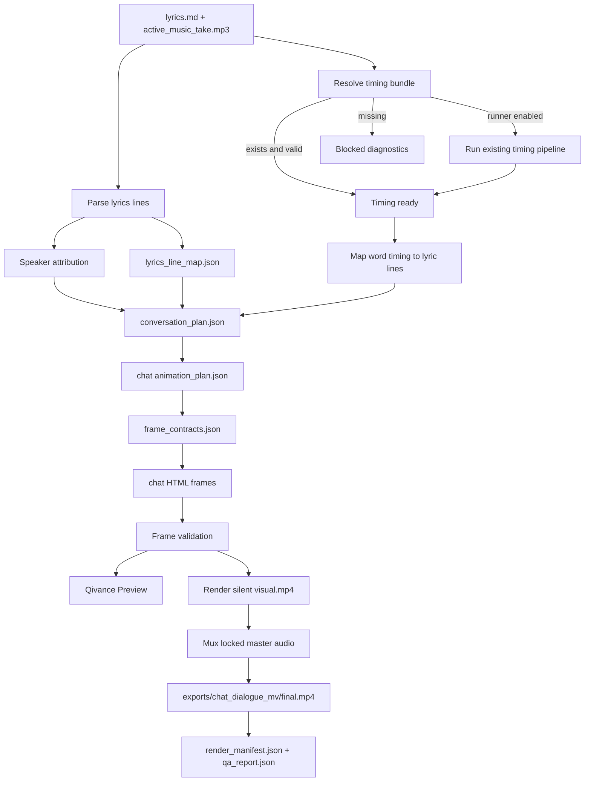

# Qivance Music x html-video 子 PRD v4：问答歌词聊天对话 MV 链路

> 日期：2026-06-15
> 状态：Draft
> 父 PRD：`docs/qivance_music_html_video_integration_prd.md`
> 校准依据：`docs/qivance_music_html_video_integration_prd.v3.md`、`docs/SPEC.v3.md`、`docs/PLAN.v3.md`、`docs/TEST_REPORT.v3.md`、`docs/requirements traceability matrix.md`、`docs/qivance_music_chat_dialogue_mv_chain_prd.md`
> 版本目标：在 V3 已验收的 Workbench/API/revision/render/export 闭环上，新增独立 `chat_dialogue_mv_chain` 和项目调度器，把问答式 rap 歌词逐句映射成双人聊天气泡 MV，并在多链路、多项目并行时合理规划任务、资源和产物写入。

---

## 1. V4 定位

V4 不重做 V3 的生产工作台，也不引入新的上游内容生产系统。V4 的主线是新增一条面向特定歌词形态的视频链路：

```text
已有项目 / fixture
→ Scheduler 读取项目、链路、资源和 artifact 状态
→ 生成 execution_plan / run_queue
→ lyrics.md + active_music_take.mp3
→ 复用或生成 production-strict timing bundle
→ 按歌词行生成 conversation_plan.json
→ 生成聊天气泡 HTML frames
→ Qivance Preview 查看
→ render silent visual
→ mux 原始 rap MP3
→ exports/chat_dialogue_mv/final.mp4
```

该链路面向一种明确输入：

```text
歌词本身已经是问答式脚本
```

链路不得把歌词改写成教学文案、解释文案或新对话。歌词是气泡文案唯一来源。

V4 同时新增一个 file-system backed scheduler。scheduler 负责把一个或多个项目拆成可执行任务，识别共享依赖，控制 WhisperX、html-video agent、Chromium render、ffmpeg 等资源的并发，避免多链路和多项目同时运行时互相覆盖产物或抢占资源。

---

## 2. 当前基线

V4 默认继承 V3 已实现并验收的能力：

```text
- file-system project model
- 基础 Workbench 页面和项目 API
- workflow_checkpoints.json
- project status aggregation
- V2/V3 timing artifacts 消费
- Librosa audio analysis runner
- WhisperX forced alignment runner
- section_map builder
- html-video workspace / agent runtime
- frame output validation
- Qivance Preview model
- render manifest
- visual render
- locked master audio mux
- ffprobe QA
- production-strict fallback policy
```

V4 不降低 V3 production gate：

```text
- production 不允许 fallback frame 计入成功
- diagnostic mode 必须显式标记
- CPU-only WhisperX diagnostic 不得计入 production 成功
- render_manifest 必须记录输入、hash、timing、frame、mux、QA 证据
- final.mp4 必须可追溯到锁定音频源
```

V3 中明确暂缓的上游能力，除非本 PRD 明确纳入，否则仍暂缓。

---

## 3. 已确认决策

| 编号 | 决策项 | 结论 |
|---|---|---|
| D1 | V4 版本形态 | 新增独立聊天对话 MV 链路 |
| D2 | 链路 ID | `chat_dialogue_mv_chain`，artifact 中使用 `chat_dialogue_mv` |
| D3 | 输入形态 | 已有项目中的问答式 `lyrics.md` 和锁定 master audio |
| D4 | 文案策略 | 气泡文本直接来自歌词原文 |
| D5 | 禁止行为 | 不翻译、不改写、不扩写、不新增解释句 |
| D6 | 角色识别 | 只识别 speaker 归属：提问者 / 回答者 |
| D7 | 显式标注 | `A:` / `B:`、`问:` / `答:`、`Q:` / `Answer:` 等前缀优先 |
| D8 | 无标注 fallback | 使用 deterministic 规则归属，不改变歌词文本 |
| D9 | Timing | 优先消费 `lyric_word_timing.json` 和 `section_map.json` |
| D10 | Timing 缺失 | 显示 blocked diagnostics；只有既有 production-strict timing runner 成功后才能继续 |
| D11 | 音频策略 | final.mp4 必须 mux 用户提交的原始 rap MP3 或锁定 master audio |
| D12 | 输出隔离 | 写入 `data/chains/chat_dialogue_mv/**` 和 `exports/chat_dialogue_mv/**`，不得覆盖其他链路 |
| D13 | 首版比例 | P0 只要求 9:16 竖屏 |
| D14 | 多链路并行 | 可与 image storyboard / source video 链路并行，但共享 timing bundle |
| D15 | Workbench | 在 V3 基础 Workbench 中增加独立链路状态，不重写前端技术栈 |
| D16 | API | 使用 project-scoped chain API，不新增数据库 |
| D17 | Preview revision | V4 P0 可复用 V3 一条自然语言 revision 机制，但不得允许 revision 改写歌词实质文本 |
| D18 | html-video Studio | 仍只作为内部 debug 工具，不暴露为生产 UI |
| D19 | 证据 | V4 需要新增 SPEC、PLAN、TEST_REPORT，并更新 traceability matrix |
| D20 | 不进入 P0 | 多聊天皮肤、群聊、头像生成、手动 timeline 编辑、模板市场、SaaS 权限 |
| D21 | 调度器定位 | 新增 storage-root 级 scheduler，负责任务拆分、依赖排序、资源分配和运行状态记录 |
| D22 | 多项目并行 | 支持多个已有项目同时排队和运行，通过项目级并发限制避免单个项目占满全部资源 |
| D23 | 多链路并行 | 同一项目内不同链路可并行运行，但共享 timing bundle 等上游产物只能生成一次 |
| D24 | 资源锁 | WhisperX/GPU、html-video agent、Chromium render、ffmpeg、image generation 等重资源必须有类型化并发限制 |
| D25 | 失败隔离 | 某项目或某链路失败不得阻塞无依赖关系的其他 ready task |
| D26 | 可观测性 | scheduler 必须写入 execution plan、run queue、resource locks 和 event log，便于恢复和排查 |

---

## 4. 输入前提

### 4.1 必需输入

V4 P0 只处理已有项目或 fixture。项目至少需要：

```text
lyrics.md
active_music_take.mp3
```

等价音频路径可由既有项目模型解析，但必须在 manifest 中记录为锁定 master audio。

### 4.2 Timing 输入

Production 路径需要以下 timing bundle：

```text
data/timing/beat_grid.json
data/timing/onset_events.json
data/timing/energy_curve.json
data/timing/lyric_word_timing.json
data/timing/alignment_report.json
data/timing/section_map.json
```

兼容既有项目中的历史路径：

```text
timing/beat_grid.json
timing/onset_events.json
timing/energy_curve.json
timing/lyric_word_timing.json
timing/alignment_report.json
timing/section_map.json
data/storyboard/section_map.json
```

如果 timing 缺失，Workbench/API 必须返回明确阻塞原因。实现可以复用既有 media E2E timing runner 生成 timing，但 production 成功必须满足 V2/V3 的证据要求。

### 4.3 不要求输入

V4 P0 不要求：

```text
image_generation_plan.json
image_assets.json
source_video.mp4
DeepSeek lyrics output
MiniMax music output
Obsidian/RAG source capsule
```

---

## 5. 输出文件模型

链路私有产物写入：

```text
data/chains/chat_dialogue_mv/
  chain_status.json
  lyrics_line_map.json
  speaker_attribution.json
  conversation_plan.json
  animation_plan.json
  frame_contracts.json
  qa_report.json

exports/chat_dialogue_mv/
  visual.mp4
  final.mp4
  render_manifest.json
```

html-video 产物继续写入既有 workspace：

```text
video/html-video/.html-video/projects/<project_id>/
  project.json
  content-graph.json
  qivance-frame-contracts.json
  codex/agent_context.json
  frames/*.html
  agent_runs/*.json
```

实现可以在 `frames/` 下使用链路前缀，例如：

```text
frames/chat_dialogue_mv_001.html
```

但 manifest 必须能区分聊天链路 frames 与其他链路 frames。

共享 timing 产物继续放在 `data/timing/**` 或既有兼容路径中，不复制到链路私有目录。

storage-root 级调度产物写入：

```text
scheduler/
  scheduler_config.json
  run_queue.json
  resource_locks.json
  scheduler_events.jsonl
  project_runs/<run_id>.json

projects/<project_id>/data/scheduler/
  execution_plan.json
  task_events.jsonl
```

`scheduler/**` 是运行协调状态，不替代项目内 artifact。项目能否通过验收仍以项目内链路产物、render manifest 和 QA report 为准。

---

## 6. 链路 DAG



---

## 7. 并行与资源规则

同一链路内部可以并行：

```text
- lyrics line parsing 与 timing bundle resolution
- speaker attribution 与 timing validation
- 多个 frame HTML 的生成
- 多个 frame 的静态 layout / contract smoke 检查
```

必须串行等待：

```text
- conversation_plan.json 必须等待 speaker attribution 和 line timing
- frame_contracts.json 必须等待 conversation_plan.json
- render 必须等待 frame validation
- mux 必须等待 visual render
- final QA 必须等待 mux 完成
```

跨链路并行：

```text
shared timing bundle
├─ chat_dialogue_mv_chain
├─ image_storyboard_mv_chain
├─ kinetic_subtitle_chain
└─ source_video_chain
```

约束：

```text
- timing bundle 只生成一次，后续链路复用
- 不同链路不得写同一个 exports/final.mp4
- 每条链路有独立 render_manifest.json
- WhisperX、Chromium render、ffmpeg 需要全局并发限制
```

---

## 8. 调度器

### 8.1 调度目标

Scheduler 的目标是在本地 file-system project model 下，合理规划项目运行时的任务分配：

```text
- 一个项目内：按 DAG 运行多个链路，复用共享 timing bundle
- 多个项目间：按项目级公平策略并行推进 ready tasks
- 多种项目形态间：同时处理 image_music_mode、source_video_mode、chat_dialogue_mv_chain 等不同任务组合
- 重资源任务：通过 resource locks 控制并发
- 轻量任务：在重资源忙碌时继续推进可并行的解析、校验、manifest 和 QA 工作
```

Scheduler 不负责重新定义业务链路。它只读取项目状态、链路能力和 artifact 依赖，然后生成可执行计划。

### 8.2 Task Model

每个 scheduler task 至少包含：

```json
{
  "task_id": "task_chat_conversation_plan_001",
  "run_id": "run_2026_06_15_001",
  "project_id": "demo_project",
  "chain_id": "chat_dialogue_mv",
  "stage": "build_conversation_plan",
  "status": "ready",
  "priority": 50,
  "dependencies": ["task_resolve_timing_001"],
  "resource_requirements": ["cpu_light", "filesystem_write"],
  "input_paths": ["lyrics.md", "data/timing/lyric_word_timing.json"],
  "output_paths": ["data/chains/chat_dialogue_mv/conversation_plan.json"],
  "diagnostic_allowed": false,
  "retry_count": 0
}
```

Task status：

```text
planned
blocked
ready
running
passed
failed
cancelled
skipped
diagnostic_only
```

V4 P0 至少需要覆盖这些 task 类型：

```text
- resolve_project_inputs
- resolve_timing_bundle
- run_timing_pipeline
- build_conversation_plan
- build_chain_animation_plan
- build_chat_frames
- validate_frames
- build_preview
- render_visual
- mux_audio
- run_media_qa
- write_render_manifest
```

实现可以让 image storyboard 和 source video 链路先以已有 V3 API task 形式接入 scheduler，不要求重写其内部实现。

### 8.3 资源类别

Scheduler 必须支持类型化资源限制：

```text
cpu_light
cpu_heavy
gpu_whisperx
html_video_agent
chromium_render
ffmpeg
image_generation
filesystem_write
```

最小配置：

```json
{
  "schema_version": 1,
  "project_parallelism": 2,
  "chain_parallelism_per_project": 2,
  "resource_limits": {
    "gpu_whisperx": 1,
    "html_video_agent": 1,
    "chromium_render": 2,
    "ffmpeg": 2,
    "image_generation": 1,
    "filesystem_write": 4
  }
}
```

默认值必须保守。没有配置时，scheduler 宁可少并发，也不能让多个重资源任务同时压垮本地环境。

### 8.4 调度规则

调度规则：

```text
- 先解析所有候选项目的输入和现有 artifacts
- 对同一项目，先生成共享依赖任务，再生成链路私有任务
- 已存在且 hash 匹配的 artifact 对应 task 标记为 skipped 或 passed
- timing bundle 对同一项目只允许一个 writer
- 不同链路的 render/export 必须写入各自 exports/<chain_id>/**
- ready queue 使用项目级公平轮转，避免一个大项目长期占满资源
- 用户显式指定 priority 时，priority 只影响 ready task 排序，不绕过依赖和资源锁
- 某 task failed 后，只阻塞依赖它的下游 task，不阻塞无关项目或无关链路
- cancelled run 必须释放 resource_locks
- 进程中断后，可通过 run_queue 和 project_runs 恢复未完成任务
```

多项目并行示例：

```text
run_queue
├─ project_a: chat_dialogue_mv_chain
├─ project_b: image_storyboard_mv_chain
└─ project_c: source_video_chain

scheduler 执行：
1. 并行完成三个项目的 input/status scan
2. project_a 与 project_b 竞争 timing writer，按 ready/priority/resource 选择
3. project_c 若不需要 WhisperX，可先进入 source-video frame/render task
4. ffmpeg render/mux 受 ffmpeg resource limit 控制
5. 任一项目失败只影响自己的依赖下游
```

### 8.5 幂等与恢复

Scheduler 必须以 artifact 为中心做幂等：

```text
- task 开始前检查 input hash 和 output hash
- output 已存在且 manifest 证明有效时，不重复运行
- output 存在但 hash 或 schema 不匹配时，标记 stale，不直接覆盖
- retry 必须写 event log，保留失败原因
- resource lock 必须有 owner、started_at 和 stale timeout
```

不得通过删除已有产物来“恢复”任务，除非用户明确要求清理。

---

## 9. 歌词解析

### 9.1 文本保真

`lyrics.md` 是气泡文案唯一来源。系统不得自动修改歌词字词。

允许：

```text
- 去除 Markdown 标题行
- 跳过空行
- 识别但不强制展示角色前缀
- 保存 raw_text 与 display_text 的对应关系
```

禁止：

```text
- 改写歌词
- 翻译歌词
- 新增解释句
- 合并多行导致原行不可追溯
- 删除歌词中的实质内容
```

### 9.2 行映射

`lyrics_line_map.json` 记录每一行的来源：

```json
{
  "schema_version": 1,
  "source": {
    "lyrics_path": "lyrics.md",
    "lyrics_sha256": "..."
  },
  "lines": [
    {
      "line_id": "line_001",
      "line_number": 12,
      "raw_text": "问：为什么模型总是乱回答？",
      "display_text": "为什么模型总是乱回答？",
      "prefix": "问：",
      "text_policy": "verbatim_lyrics"
    }
  ]
}
```

`display_text` 只能移除角色前缀或两侧空白，不得改写实质文本。

---

## 10. Speaker 归属

角色固定为：

```text
questioner -> left
answerer   -> right
```

识别优先级：

1. 显式双人标签：

```text
A:
B:
甲：
乙：
```

2. 显式问答标签：

```text
Q:
A:
Question:
Answer:
问：
答：
提问：
回答：
```

3. 疑问标点或疑问词：

```text
？ ? 为什么 怎么 是否 能不能 是不是 哪个 谁 什么
```

4. 上下文交替：

```text
如果无显式标注且无法判断，按上一条消息 speaker 交替。
```

5. 保守 fallback：

```text
整段无法判断时，默认第一句 questioner，下一句 answerer，之后交替。
```

`speaker_attribution.json` 必须记录每行归属原因：

```json
{
  "line_id": "line_001",
  "speaker": "questioner",
  "side": "left",
  "attribution_source": "explicit_prefix",
  "confidence": 1.0
}
```

---

## 11. Timing 规则

### 11.1 行级 timing

首选：

```text
lyric_word_timing.json
→ line_id 聚合
→ 每行 start_sec / end_sec
```

允许 fallback：

```text
lyrics line count
→ section duration 或 total duration 均分
→ beat_grid 吸附
```

fallback 只能用于显式 diagnostic 或用户接受的低置信度预览，不能默认为 production 成功证据。若 P0 实现决定允许 fallback production，必须在 SPEC.v4 中给出可测试的质量门槛并更新本 PRD。

### 11.2 气泡弹出点

```text
- 气泡进入时间以 line start 为准
- 可向最近 beat/onset 吸附，但漂移不超过 0.25s
- 不得为了动画改变 message 语义时间
- 超短行最短显示 0.6s
- 新气泡进入不得早于其 line start
- 相邻气泡可重叠显示
```

### 11.3 section map

`section_map.json` 用于：

```text
- frame / scene 边界
- 聊天背景节奏变化
- 气泡列表窗口滚动策略
- render duration
```

聊天链路只消费 section map，不在 HTML runtime 中重新推断段落。

---

## 12. `conversation_plan.json`

`conversation_plan.json` 是 V4 核心合同。

```json
{
  "schema_version": 1,
  "chain_id": "chat_dialogue_mv",
  "text_policy": "verbatim_lyrics",
  "source": {
    "lyrics_path": "lyrics.md",
    "audio_path": "active_music_take.mp3",
    "lyrics_sha256": "...",
    "audio_sha256": "..."
  },
  "speakers": [
    {
      "id": "questioner",
      "label": "提问者",
      "side": "left"
    },
    {
      "id": "answerer",
      "label": "回答者",
      "side": "right"
    }
  ],
  "messages": [
    {
      "id": "msg_001",
      "source_line_id": "line_001",
      "speaker": "questioner",
      "side": "left",
      "raw_text": "问：为什么模型总是乱回答？",
      "display_text": "为什么模型总是乱回答？",
      "text_policy": "verbatim_lyrics",
      "attribution_source": "explicit_prefix",
      "start_sec": 0.82,
      "end_sec": 2.4,
      "section_id": "sec_001",
      "confidence": 1.0
    }
  ]
}
```

校验要求：

```text
- schema_version 必须为 1
- chain_id 必须为 chat_dialogue_mv
- text_policy 必须为 verbatim_lyrics
- 每条 message 必须有 source_line_id
- raw_text 必须来自 lyrics.md
- display_text 只能移除前缀或空白
- start_sec < end_sec
- message 时间范围必须在音频时长内
- messages 必须按时间排序
- section_id 必须能追溯到 section_map
```

---

## 13. Chat Animation Plan

V4 需要从 `conversation_plan.json` 生成链路私有 `animation_plan.json`。

最小结构：

```json
{
  "schema_version": 1,
  "chain_id": "chat_dialogue_mv",
  "target_ratio": "9:16",
  "duration_sec": 60.0,
  "template": {
    "id": "mobile_dual_chat_default",
    "variant": "dark_short_video_chat"
  },
  "message_animations": [
    {
      "message_id": "msg_001",
      "enter_sec": 0.82,
      "exit_sec": 4.2,
      "side": "left",
      "motion": "bubble_pop",
      "beat_accent": true
    }
  ],
  "scroll_windows": [
    {
      "section_id": "sec_001",
      "start_sec": 0.0,
      "end_sec": 8.0,
      "visible_message_ids": ["msg_001", "msg_002"]
    }
  ]
}
```

约束：

```text
- 所有动画时间来自 conversation_plan 和 timing bundle
- HTML runtime 不得重新计算 message 文案
- 长句必须换行并完整显示
- frame duration 必须满足 strict duration
- 动效只能增强节奏，不得遮挡文本
```

---

## 14. HTML 模板

P0 使用一个固定模板：

```text
9:16 竖屏
手机聊天界面
左右双人气泡
顶部短视频状态栏
底部输入栏或轻量装饰
消息按时间弹出
列表自动滚动
beat/onset 驱动轻微弹跳、闪烁或震动
```

模板要求：

```text
- 不依赖远程资源
- 不读取未登记本地文件
- 所有时间由内嵌 JSON 或 frame contract 驱动
- 文本必须在气泡内完整显示
- 长句允许换行，不允许溢出
- 不允许 runtime 改写 message 文本
- 不允许把聊天模板作为 html-video Studio 生产 UI 暴露
```

视觉默认应服务短视频阅读效率，避免复杂装饰压过歌词文本。

---

## 15. Workbench 与 API

V4 在 V3 Workbench 中增加独立链路状态，不替换项目级状态。

建议状态：

```text
not_started
input_ready
timing_blocked
timing_ready
conversation_plan_ready
frames_ready
preview_ready
rendering
export_ready
failed
diagnostic_only
```

建议 API：

```text
GET  /api/projects/:id/chains
GET  /api/projects/:id/chains/chat-dialogue-mv/status
POST /api/projects/:id/chains/chat-dialogue-mv/run
POST /api/projects/:id/chains/chat-dialogue-mv/build-conversation-plan
POST /api/projects/:id/chains/chat-dialogue-mv/build-frames
GET  /api/projects/:id/chains/chat-dialogue-mv/preview
POST /api/projects/:id/chains/chat-dialogue-mv/revise
POST /api/projects/:id/chains/chat-dialogue-mv/export/render
GET  /api/projects/:id/chains/chat-dialogue-mv/export/final.mp4

GET  /api/scheduler/status
GET  /api/scheduler/runs
POST /api/scheduler/runs
GET  /api/scheduler/runs/:runId
POST /api/scheduler/runs/:runId/cancel
```

API 要求：

```text
- 校验 project id 和 path boundary
- 返回稳定 JSON errors
- 不直接暴露任意文件路径读取
- 不创建数据库依赖
- 不覆盖 V3 现有 export/final.mp4
- mutation 必须记录 chain_status.json 或等价 checkpoint
- scheduler mutation 必须记录 run_id、execution_plan、resource_locks 和 event log
- scheduler API 必须支持单项目单链路、多链路和多项目 run request
```

Workbench 至少展示：

```text
- scheduler 当前运行状态、ready/running/blocked task 数量
- active projects 和 active chains
- resource locks 与等待队列
- 链路输入状态
- timing bundle 状态和阻塞原因
- speaker attribution 摘要
- conversation_plan message 数量和低置信度项
- frame validation 状态
- preview 入口
- render/export 状态
- final.mp4 下载入口
```

---

## 16. Render / Export / Manifest

Render 流程：

```text
chat HTML frames
→ html-video visual render
→ exports/chat_dialogue_mv/visual.mp4
→ mux locked master audio
→ exports/chat_dialogue_mv/final.mp4
```

导出要求：

```text
- final.mp4 有且只有一个音频流
- 音频来源为用户提交 MP3 或锁定 master audio
- final duration 与音频 duration 漂移不超过 150ms
- render_manifest.json 记录 chain_id、输入 hash、timing、conversation plan、frames、visual render、mux QA
- render_manifest.json 明确标记 production 或 diagnostic
- diagnostic/fallback 不得计入 V4 production success
```

V4 render manifest 可以复用 V3 manifest 字段，但必须增加链路信息：

```json
{
  "schema_version": 4,
  "chain": {
    "id": "chat_dialogue_mv",
    "mode": "production",
    "conversation_plan": {
      "path": "data/chains/chat_dialogue_mv/conversation_plan.json",
      "sha256": "..."
    }
  }
}
```

---

## 17. 验收标准

V4 P0 完成时必须满足：

```text
- 可以在已有项目中识别聊天对话 MV 链路可用性
- 缺失 lyrics、audio 或 timing 时返回明确 blocked diagnostics
- 可以从 lyrics.md 生成 lyrics_line_map.json
- 可以生成 speaker_attribution.json
- 可以生成 conversation_plan.json
- conversation_plan 中的 raw_text 全部来自 lyrics.md
- display_text 不改写实质歌词
- 显式问答前缀能稳定分配左右角色
- 无显式前缀时有 deterministic fallback
- message timing 来自 lyric_word_timing / section_map，或显式 diagnostic fallback
- 可以生成 9:16 聊天气泡 HTML frames
- frame validation 拒绝 remote resource、未登记本地路径、文本溢出和 duration 违规
- 可以通过 Qivance Preview 查看聊天 MV
- 可以 render exports/chat_dialogue_mv/visual.mp4
- 可以 mux 锁定 master audio 并输出 exports/chat_dialogue_mv/final.mp4
- final.mp4 保留原始 rap 音频
- render_manifest.json 和 qa_report.json 可追溯全部输入、timing、conversation plan、frames 和导出文件
- 该链路产物不覆盖其他链路产物
- 可以为单项目多链路生成 execution_plan
- 可以为多个项目生成统一 run_queue
- scheduler 能复用同一项目的 timing bundle，不重复生成共享产物
- scheduler 能限制 WhisperX、html-video agent、Chromium render、ffmpeg 等重资源并发
- 多项目并行时，一个项目失败不阻塞无依赖关系的其他项目 task
- scheduler_events.jsonl 和 project_runs/<run_id>.json 能追溯任务状态、资源分配、失败原因和重试记录
- 中断后可以从 scheduler 文件状态恢复未完成 run，且不会覆盖有效产物
- V3 既有 focused tests、typecheck 和 production-strict 回归不被破坏
```

---

## 18. 非目标

V4 P0 明确不做：

```text
- 新建项目向导
- 文件上传入口
- DeepSeek 歌词生成
- MiniMax 音乐生成
- LLM 改写歌词
- LLM 生成新对话
- 多聊天皮肤
- 群聊模式
- 自动头像生成
- 手动 speaker attribution 编辑器
- 手动拖拽气泡 timing
- 完整 timeline editor
- 模板市场
- 数据库 / Prisma / SQLite / Postgres
- Next.js / React / Vite 重写
- OpenDesign 最终视觉实现
- SaaS 权限 / 登录 / Cloudflare Access
- 分布式队列 / 云端 worker
- 多机器调度
- 数据库型任务队列
- 计费优先级或租户隔离
- 自动扩缩容
- resources.zip
```

---

## 19. 风险与待细化点

后续 SPEC.v4 必须细化：

```text
- lyrics.md 行过滤规则：标题、注释、段落标签如何处理
- A: 既可能表示 speaker A，也可能表示 Answer 的冲突优先级
- word timing 到 line timing 的精确聚合算法
- 低置信度 speaker attribution 的 QA 阈值
- 超长歌词行在 9:16 气泡中的换行和字号策略
- frame validation 如何自动发现文本溢出
- 链路级 render_manifest 与 V3 manifest 的兼容字段
- chain API 是否复用 V3 revision_request.json 或新增链路私有 revision 文件
- 多链路并发时的全局锁和队列策略
- scheduler resource lock 的 stale timeout 和恢复策略
- 多项目公平调度的默认权重
- priority 与 fairness 冲突时的决策规则
- artifact hash 变化后哪些下游 task 必须失效
- cancel / retry / resume 的用户可见语义
- scheduler event log 是否需要压缩或归档
```

---

## 20. 文档交付要求

V4 实施前后按顺序补齐：

1. 从本 PRD 写 `docs/SPEC.v4.md`。
2. 从 SPEC 写 `docs/PLAN.v4.md`。
3. 实施后写 `docs/TEST_REPORT.v4.md`。
4. 更新 `docs/requirements traceability matrix.md` 的 V4 状态、证据和后续范围。
5. 若后续进入 OpenDesign/Next.js 重写，新增设计交接 PRD 或 Delta SPEC，不覆盖本 V4 PRD 的链路合同。

---

## 21. 与现有草稿的关系

`docs/qivance_music_chat_dialogue_mv_chain_prd.md` 是 V4 的早期链路草稿。本文件把该草稿纳入正式版本序列，并按 V3 已实现状态补齐：

```text
- V3 继承能力
- production-strict gate
- project-scoped chain API
- 链路私有 artifacts
- scheduler execution plan / run queue / resource locks
- Workbench 状态
- render manifest evidence
- 文档交付顺序
```

后续实现以本 V4 PRD 为版本源文档。
